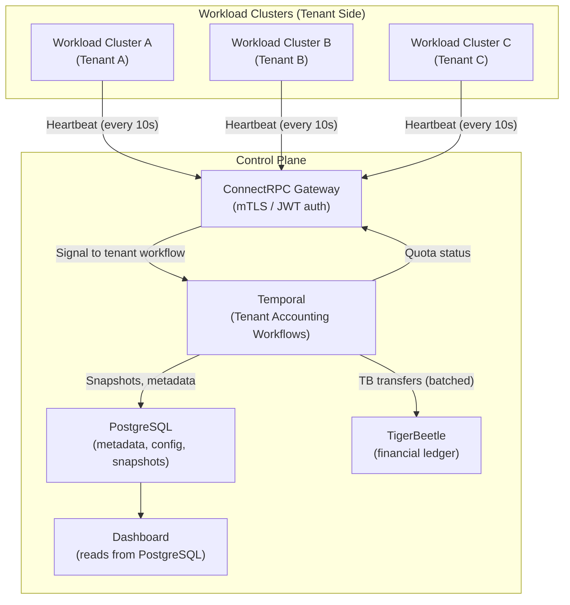
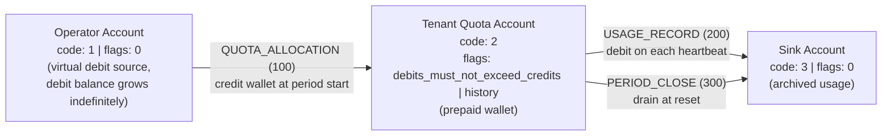
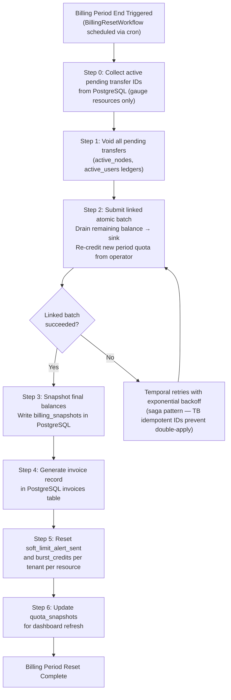
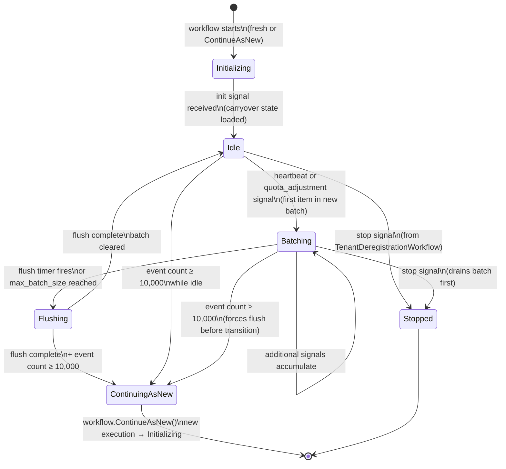

# BYOC Cloud Credit System

**Architecture Design Document**

_Version 0.4 — Draft_

---

## Executive Summary

This document describes a resource accounting and quota enforcement system for a Bring-Your-Own-Cloud (BYOC) deployment model. The system serves two first-class purposes:

1. **Reporting & Auditing**: The system is a usage accounting mechanism. Generating accurate, auditable usage reports per tenant per resource per billing period is a primary goal. TigerBeetle's immutable transfer history combined with `flags.history` on accounts provides the raw audit trail; PostgreSQL billing snapshots provide the queryable reporting layer accessible to dashboards and stakeholders.

2. **Wallet-Based SaaS Plan Enforcement**: Each tenant's TigerBeetle quota account is a **prepaid wallet** loaded with credits according to their contractual SaaS plan. The `debits_must_not_exceed_credits` flag is the engineering-level enforcement of contractual limits — no application-level check can be bypassed. The mapping is: SaaS plan tier → quota config in PostgreSQL → credit amount loaded into TigerBeetle wallet → atomic enforcement on every usage transfer.

These two purposes frame the entire system. The Control Plane manages tenant **Workload Clusters**, tracking resource consumption via a double-entry ledger (TigerBeetle) and enforcing both hard and soft limits on sliceable resources.

**Scale**: ~100 tenants × 1 heartbeat/10s × ~20 metrics each = **10 heartbeats/sec** → **~200 TigerBeetle transfers/sec**. This is far below Kafka's throughput sweet spot; **Temporal** provides the same durability guarantees with significantly less operational complexity at this scale.

> **Metric cardinality note**: The "~20 metrics each" figure refers to the ~20 raw heartbeat fields the agent collects (e.g., `cpu_ms_delta`, `memory_mb_seconds_delta`, `active_nodes`, `active_users`, `storage_bytes`, GPU slices, etc.) — each becomes a billable TigerBeetle ledger write. The **Ledger Design** section below lists 7 ledgers as the current illustrative set; the ~20 ledger target is the full production scope. The **batch sizing table** uses 7 resources (consistent with the illustrative set): `3 hb × 7 resources = 21 transfers` per example. The exec-summary ~200 TB transfers/sec figure assumes the full ~20 ledger target. These numbers are consistent and deliberately document different points on the same scale curve.

---

## Non-Goals (v0.3 Scope)

This design intentionally excludes the following. Each is a valid future concern but is out of scope for the current implementation:

- **Multi-region deployment**: The system is designed as a single-region Control Plane. TigerBeetle cross-datacenter replication and cross-region quota consistency are not yet designed. See [Extensibility — Multi-Region](#multi-region) for options.
- **Adversarial metering guarantees**: The system trusts agent-reported metrics. It cannot detect underreporting by a compromised agent. Anomaly detection via cloud-provider API spot-checks is an out-of-scope product decision. See [Open Question #10](#open-questions--decisions-needed).
- **Sub-heartbeat billing granularity**: The finest billing granularity is one heartbeat interval (~10 seconds). Per-second or per-request metering is not addressed.
- **Cross-tenant quota sharing**: Each tenant has an independent quota wallet. Shared pools across tenants are not supported.
- **Real-time TigerBeetle query access from the dashboard**: The dashboard reads from PostgreSQL `quota_snapshots` only. Direct TB balance queries from external clients (dashboard, API consumers) are not exposed.

---

## Core Concepts

### Deployment Topology

The architecture distinguishes between:

- **Control Plane:** The central cluster that manages configuration, authentication, quota enforcement, and billing. Tenants never directly access this.
- **Workload Clusters:** Tenant workload clusters running in their own cloud accounts. These send heartbeats to the Control Plane at regular intervals.
- **Credits:** The unit of account for resource consumption. Each resource type (CPU, memory, storage, etc.) is denominated in credits based on SaaS plan tiers.

### Resource Types

The system tracks two categories of resources:

| Category          | Examples                                              | Measurement                                               |
| ----------------- | ----------------------------------------------------- | --------------------------------------------------------- |
| **Cumulative**    | CPU-hours, memory-GB-hours, network egress, API calls | Delta reported each heartbeat, summed over billing period |
| **Point-in-time** | Active users, active nodes, storage used, GPU slices  | Current count/gauge reported each heartbeat               |

### Credit-Balance Convention

Tenant quota accounts use a **credit-balance model**: the wallet starts with credits (the plan allocation) and is debited as resources are consumed.

```
available = credits_posted - debits_posted - debits_pending
```

"Debiting" means consuming quota. When `available` reaches zero, the `debits_must_not_exceed_credits` flag causes TigerBeetle to reject further transfers atomically — this is the hard limit. The wallet analogy: the tenant has a prepaid balance; each heartbeat's usage is a withdrawal; when the balance is empty, the card is declined.

---

## System Architecture

### Component Overview



### Component Responsibilities

#### ConnectRPC Gateway

- Exposes typed RPC endpoints for workload clusters (heartbeat, config pull, key rotation)
- Validates tenant authentication (mTLS or JWT)
- Deduplicates heartbeats by `sequence_number` before signaling Temporal (see [Gateway Idempotency](#gateway-idempotency))
- Signals the tenant's `TenantAccountingWorkflow` in Temporal
- Returns quota status synchronously from PostgreSQL `quota_snapshots` (never queries TigerBeetle directly)

**Why ConnectRPC**: Serves gRPC (for workload cluster agents), gRPC-Web (for the dashboard), and the Connect protocol (for curl/debugging) from the same handler — eliminating the need for a separate gRPC-Web proxy (e.g., Envoy).

#### Temporal (Durable Workflow Engine)

Temporal replaces both the Kafka message bus and the custom worker pool. See [Temporal Workflow Design](#temporal-workflow-design) for details.

- **`TenantAccountingWorkflow`** (one per tenant, long-running): receives heartbeat signals, processes them sequentially per tenant, batches TB transfers
- **`BillingResetWorkflow`** (scheduled): executes billing period reset as a saga with automatic compensation on failure
- **`QuotaAdjustmentWorkflow`**: handles mid-period quota changes (plan upgrades, surge packs, manual credits)
- Provides exactly-once semantics via deterministic activity IDs + TigerBeetle idempotent transfers
- Built-in durable state: no data loss on worker crash, no custom retry logic required

#### TigerBeetle (Financial Ledger)

- Double-entry accounting for all resource consumption
- Tenant quota accounts act as prepaid wallets; `debits_must_not_exceed_credits` enforces hard limits atomically
- `flags.history` enables `get_account_balances` for historical balance snapshots (audit trail and reporting foundation)
- Immutable transfer history is the source of truth for all usage data

**Why TigerBeetle**: Purpose-built for financial-grade accounting. Provides ACID guarantees, native overdraft protection, and an immutable audit log. TigerBeetle stores only accounts and transfers with fixed schemas — all relational metadata, configuration, and human-readable data lives in PostgreSQL.

#### PostgreSQL (Metadata & Reporting Store)

- Tenant profiles, contact info, billing tier
- Quota configuration (limits, soft/hard thresholds, alerting rules, plan assignments)
- Workload cluster registry (IDs, last heartbeat, status)
- `quota_snapshots` — near-real-time materialized view updated by Temporal on each heartbeat (dashboard reads this, never TigerBeetle directly)
- `billing_snapshots` — end-of-period usage records for invoice generation and usage reports

**Why PostgreSQL**: TigerBeetle is a ledger, not a general-purpose database. All relational queries, human-readable data, and reporting projections belong in PostgreSQL. Row-Level Security (RLS) provides multi-tenant isolation.

---

## TigerBeetle Modeling

This section describes how to model the cloud credit system using TigerBeetle's primitives, aligned with [TigerBeetle's data modeling guidance](https://docs.tigerbeetle.com/coding/data-modeling/).

### Core Concepts Mapping

| Cloud Credit Concept                       | TigerBeetle Primitive                                                              |
| ------------------------------------------ | ---------------------------------------------------------------------------------- |
| Resource type (CPU, memory, storage, etc.) | **Ledger** (32-bit field) — one ledger per resource type                           |
| Tenant quota wallet                        | **Account** with `flags.debits_must_not_exceed_credits \| flags.history`           |
| Usage accumulation                         | **Transfer** debiting tenant quota account                                         |
| Hard limit enforcement                     | Native overdraft protection via account flags                                      |
| Soft limit warning                         | Application logic checking balance thresholds                                      |
| Billing period reset                       | Linked drain + re-credit transfers (atomic)                                        |

### Ledger Design

Each sliceable resource gets its own ledger (`ledger` is a 32-bit field). This ensures accounts for different resource types cannot accidentally transact with each other.

```
Ledger 1: cpu_hours
Ledger 2: memory_gb_hours
Ledger 3: storage_gb
Ledger 4: network_egress_gb
Ledger 5: active_nodes        (point-in-time gauge)
Ledger 6: active_users        (point-in-time gauge)
Ledger 7: gpu_hours
```

**Why separate ledgers?** Ledgers partition accounts that can transact together. A CPU-hours account should never transfer to a storage account — they're different units. Separate ledgers enforce this at the database level.

### Account Structure

#### Account Fields Usage

| Field           | Usage                                                                                     |
| --------------- | ----------------------------------------------------------------------------------------- |
| `id`            | 128-bit unique ID stored in PostgreSQL `tb_account_ids` mapping table                     |
| `ledger`        | Resource type identifier (32-bit, non-zero)                                               |
| `code`          | Account type (16-bit, non-zero): `1` = operator, `2` = tenant_quota, `3` = sink          |
| `user_data_128` | Tenant UUID (links account to PostgreSQL tenant record)                                   |
| `user_data_64`  | Billing period start timestamp (nanoseconds since epoch)                                  |
| `user_data_32`  | `base_plan_id` FK referencing PostgreSQL `base_plans` (for audit reference at creation)   |
| `flags`         | See Account Flags table below                                                             |

**Note on `user_data_32`**: Per-resource plan selection lives in PostgreSQL `quota_configs`; `user_data_32` captures the plan ID at account creation time for audit reference only. The per-resource plan mapping is authoritative in PostgreSQL, not in TigerBeetle metadata.

#### Account Types Per Tenant Per Resource



#### Account Flags

| Account Type | Flags                                                                                                       |
| ------------ | ----------------------------------------------------------------------------------------------------------- |
| Operator     | `0` — no constraints; debit balance grows indefinitely (expected behavior for a virtual source)             |
| Tenant Quota | `flags.debits_must_not_exceed_credits \| flags.history` — hard limit enforcement + historical balance data  |
| Sink         | `0` — receives archived usage at period end                                                                 |

**`flags.history` is required for reporting**: This flag must be set at account creation time (it is immutable — cannot be added later). It enables `get_account_balances`, which returns historical balance snapshots at each transfer — the foundation for usage-over-time reports, billing period summaries, and audit trails. Omitting this flag would be a critical gap given that reporting is a primary system goal.

**Hard limit enforcement**: With `debits_must_not_exceed_credits` set, TigerBeetle rejects any transfer where `debits_pending + debits_posted + amount > credits_posted`. No application-level check can be bypassed.

### Account ID Scheme

Encoding a truncated tenant UUID directly into the 128-bit account ID (bit-packing) has two problems: collision risk from truncating 128-bit UUIDs to 64 bits, and poor LSM-tree ordering. Instead, **use PostgreSQL as the ID mapping table**.

```sql
CREATE TABLE tb_account_ids (
  tenant_id     UUID NOT NULL,
  resource_type TEXT NOT NULL,
  account_type  TEXT NOT NULL CHECK (account_type IN ('operator', 'tenant_quota', 'sink')),
  tb_account_id BYTEA NOT NULL,  -- 128-bit TigerBeetle ID
  created_at    TIMESTAMPTZ DEFAULT NOW(),
  PRIMARY KEY (tenant_id, resource_type, account_type)
);
```

TigerBeetle account IDs are generated as time-based 128-bit IDs at account creation time and stored in this mapping. Accounts are created infrequently (once per tenant per resource type), so PostgreSQL lookup is not a hot path.

**Transfer IDs** are time-based, generated at submission time:

```
id = (timestamp_ms << 80) | random_80bits
```

For idempotent retries, use deterministic IDs derived from heartbeat data (see [Exactly-Once Processing](#exactly-once-processing-defense-in-depth)).

### Global vs Per-Tenant Accounts

With ~100 tenants × 7 resource types × 3 account types = ~2,100 accounts. **Operator and Sink accounts can be global per ledger** (1 operator + 1 sink per ledger = 14 global accounts), reducing the total to ~700 tenant quota accounts + 14 global accounts.

### Transfer Patterns

#### 1. Quota Allocation (Billing Period Start)

Credit the tenant's quota wallet from the global operator account.

```
Transfer {
  id:                <time-based-id>,
  debit_account_id:  <global_operator_account[ledger]>,
  credit_account_id: <tenant_quota_account>,
  amount:            1_000_000,            // e.g., 1M CPU-milliseconds (base plan)
  ledger:            1,                    // cpu_hours (32-bit)
  code:              100,                  // QUOTA_ALLOCATION
  user_data_128:     <tenant_uuid>,
  user_data_64:      <billing_period_start_ns>,
}
```

#### 2. Usage Recording (Heartbeat)

Debit the tenant's quota account. Fails atomically if the wallet is exhausted.

```
Transfer {
  id:                <deterministic-id: hash(cluster_id, heartbeat_ts, resource_type)>,
  debit_account_id:  <tenant_quota_account>,
  credit_account_id: <global_sink_account[ledger]>,
  amount:            47_000,               // 47 CPU-seconds since last heartbeat
  ledger:            1,                    // cpu_hours (32-bit)
  code:              200,                  // USAGE_RECORD
  user_data_128:     <cluster_id>,         // which workload cluster reported this
  user_data_64:      <heartbeat_timestamp_ns>,
}
```

**If this transfer fails with `exceeds_credits`**: the tenant has exhausted their wallet (base + burst). The hard limit is enforced.

#### 3. Soft Limit Check (Application Logic)

Soft limits are checked by Temporal activities before submitting transfers. **This check is inherently approximate** — concurrent workflows cannot atomically read-then-write, so the hard limit (TigerBeetle's atomic rejection) is the true safety net.

```go
// Temporal activity — before recording usage
account := tb.LookupAccount(tenantQuotaAccountID)
available := account.CreditsPosted - account.DebitsPosted - account.DebitsPending

if available < softLimitThreshold {
    // Deduplicate via PG flag to avoid redundant alerts across concurrent activities
    if !isSoftLimitAlertSent(ctx, tenantID, resourceType, billingPeriod) {
        markSoftLimitAlertSent(ctx, tenantID, resourceType, billingPeriod)
        emitSoftLimitAlert(tenant, resource, available)
    }
}
// Proceed with transfer — soft limit never blocks
```

**Deduplication**: Use a PostgreSQL boolean `soft_limit_alert_sent` per `(tenant_id, resource_type, billing_period)` in `quota_configs`. Reset at billing period start.

#### 4. Billing Period Reset (Atomic)

A crash between drain and re-credit would leave the tenant with zero quota. Use `flags.linked` to make drain+re-credit a single atomic batch.

**Step 0 — gauge resources only**: Void all active pending transfers before the drain (pending transfers are not drained by `balancing_debit`).

```
// For each active pending transfer (active_nodes, active_users ledgers)
Transfer {
  id:          <new-id>,
  pending_id:  <original-pending-transfer-id>,
  flags:       flags.void_pending_transfer,
}
```

**Step 1+2 — linked atomic batch**: Drain remaining balance and re-credit in one operation.

```
// Linked batch — all succeed or all fail
Transfer {
  id:                <time-based-id>,
  debit_account_id:  <tenant_quota_account>,
  credit_account_id: <global_sink_account[ledger]>,
  amount:            AMOUNT_MAX,
  ledger:            1,
  code:              300,                  // PERIOD_CLOSE
  flags:             flags.balancing_debit | flags.linked,
}
Transfer {
  id:                <time-based-id>,
  debit_account_id:  <global_operator_account[ledger]>,
  credit_account_id: <tenant_quota_account>,
  amount:            <new_period_quota>,
  ledger:            1,
  code:              100,                  // QUOTA_ALLOCATION
  user_data_64:      <new_billing_period_start_ns>,
  flags:             0,                    // last in linked chain — no linked flag
}
```

#### 5. Pending Transfer Refresh (Gauge Resources)

For point-in-time gauges (active nodes/users), pending transfers expire with a timeout. **TigerBeetle has no "refresh" primitive** — the workload cluster must void the expiring transfer and create a new one. Use `flags.linked` to make void+new-pending atomic, preventing a concurrent worker from stealing the slot between operations.

```
// Linked: void old pending + create new pending atomically
Transfer {
  id:          <new-id>,
  pending_id:  <expiring-pending-transfer-id>,
  flags:       flags.void_pending_transfer | flags.linked,
}
Transfer {
  id:                <new-pending-transfer-id>,
  debit_account_id:  <tenant_quota_account[active_nodes]>,
  credit_account_id: <global_sink_account[active_nodes]>,
  amount:            1,
  ledger:            5,     // active_nodes
  code:              400,   // NODE_ACTIVATE
  timeout:           30,    // 30 seconds — workload cluster heartbeats every 10s
  flags:             flags.pending,
}
```

If a workload cluster disappears (missed heartbeats), the pending transfer times out and the slot is automatically reclaimed.

#### 6. Surge Pack Credit (Mid-Period Top-Up)

When a tenant purchases a surge pack, immediately credit their wallet.

```
Transfer {
  id:                <time-based-id>,
  debit_account_id:  <global_operator_account[ledger]>,
  credit_account_id: <tenant_quota_account>,
  amount:            <surge_pack_credit_amount>,
  ledger:            1,
  code:              102,                  // SURGE_PACK_CREDIT
  user_data_128:     <surge_purchase_id>,  // links to PG surge_purchases table
  user_data_64:      <purchase_timestamp_ns>,
}
```

### Linked Transfers — Clarification

`flags.linked` makes multiple transfers **atomically succeed or fail together**. Each transfer in a linked chain still operates within its own ledger — cross-ledger atomicity is achieved via linkage, not via a single primitive. If any transfer in a linked chain fails, all preceding transfers in the chain are rolled back.

```
// All succeed or all fail
Transfer { ..., ledger: 1, code: 200, flags: flags.linked }  // CPU
Transfer { ..., ledger: 2, code: 200, flags: flags.linked }  // Memory
Transfer { ..., ledger: 3, code: 200, flags: 0 }             // Storage (last — no linked flag)
```

### Code Values (Transfer Types)

| Code | Meaning                                                            |
| ---- | ------------------------------------------------------------------ |
| 100  | `QUOTA_ALLOCATION` — base plan credit at period start              |
| 101  | `QUOTA_ADJUSTMENT` — manual credit issued by support               |
| 102  | `SURGE_PACK_CREDIT` — surge pack purchased mid-period              |
| 200  | `USAGE_RECORD` — heartbeat usage debit                             |
| 201  | `USAGE_CORRECTION` — correcting a prior usage record               |
| 300  | `PERIOD_CLOSE` — drain balance at period end                       |
| 400  | `NODE_ACTIVATE` — pending transfer for active node slot            |
| 401  | `USER_ACTIVATE` — pending transfer for active user slot            |

### Usage Correction Flow

`USAGE_CORRECTION` (code 201) is the mechanism for correcting previously recorded usage after the fact.

**When to use**:
- Agent bug caused over- or under-reporting of usage
- Metering subsystem failure (e.g., metrics-server outage caused missed deltas)
- Billing dispute: tenant disputes a specific usage charge

**Invariants**:
- Can be **positive** (refund: operator→tenant_quota, credits the wallet back) or **negative** (missed usage: tenant_quota→sink, debits the wallet for uncharged usage)
- Must be **linked to the original transfer** via `user_data_128` (set to the original transfer's ID)
- Requires **Admin authority** — not Support. Support can issue ad-hoc positive credits (`QUOTA_ADJUSTMENT`, code 101); corrections that may be negative require Admin to prevent abuse.
- Affects the **current billing period snapshot** — corrections within a period are reflected in `billing_snapshots` at period close

**Transfer structure (positive correction — refund)**:
```
Transfer {
  id:                hash(original_transfer_id, "correction", correction_ts),  // deterministic
  debit_account_id:  <global_operator_account[ledger]>,
  credit_account_id: <tenant_quota_account>,
  amount:            <correction_amount>,
  ledger:            <same ledger as original transfer>,
  code:              201,                         // USAGE_CORRECTION
  user_data_128:     <original_transfer_id>,      // links correction to original
  user_data_64:      <correction_timestamp_ns>,
}
```

For a **negative correction** (missed usage), reverse debit/credit direction: `tenant_quota_account → global_sink_account`.

**Schema addition** — corrections are exposed as a separate line item in billing snapshots:
```sql
ALTER TABLE billing_snapshots ADD COLUMN correction_credits BIGINT NOT NULL DEFAULT 0;
```

**Billing report decomposition** (updated):
```
Base plan allocation:  SUM(amount) WHERE code = 100
Surge pack credits:    SUM(amount) WHERE code = 102
Manual credits:        SUM(amount) WHERE code = 101
Corrections (net):     SUM(amount * sign) WHERE code = 201   -- positive = refund, negative = clawback
Total consumed:        SUM(amount) WHERE code = 200
Net available:         (100 total) + (102 total) + (101 total) + (201 net) - (200 total)
```

**Execution path**: `QuotaAdjustmentWorkflow` with `adjustment_type = USAGE_CORRECTION` and Admin role. Activity 1 validates the Admin role (Support role is rejected for code 201). The correction transfer is signaled to `TenantAccountingWorkflow` for single-writer TB semantics, identical to other adjustment flows.

### Querying Balances

```go
// Get current available quota
account := tb.LookupAccount(tenantQuotaAccountID)
available := account.CreditsPosted - account.DebitsPosted - account.DebitsPending
utilization := float64(account.DebitsPosted) / float64(account.CreditsPosted) * 100
```

---

## Data Model

### PostgreSQL Schema (Core Tables)

```sql
-- tenants
CREATE TABLE tenants (
  id              UUID PRIMARY KEY,
  name            TEXT NOT NULL,
  billing_tier    TEXT CHECK (billing_tier IN ('free', 'starter', 'pro', 'enterprise')),
  created_at      TIMESTAMPTZ DEFAULT NOW()
);

-- workload_clusters
CREATE TABLE workload_clusters (
  id              UUID PRIMARY KEY,
  tenant_id       UUID REFERENCES tenants(id),
  cloud_provider  TEXT CHECK (cloud_provider IN ('aws', 'gcp', 'azure')),
  region          TEXT,
  last_heartbeat  TIMESTAMPTZ,
  status          TEXT CHECK (status IN ('healthy', 'degraded', 'unreachable', 'suspended'))
);

-- base_plans: 8 plans per resource type
CREATE TABLE base_plans (
  id              UUID PRIMARY KEY,
  resource_type   TEXT NOT NULL,
  name            TEXT NOT NULL,  -- e.g., 'free-128m', 'starter-500m', 'pro-2000m'
  credit_amount   BIGINT NOT NULL,
  UNIQUE (resource_type, name)
);

-- quota_configs: per-tenant per-resource plan assignment and limits
CREATE TABLE quota_configs (
  tenant_id             UUID REFERENCES tenants(id),
  resource_type         TEXT NOT NULL,
  base_plan_id          UUID REFERENCES base_plans(id),
  hard_limit            BIGINT NOT NULL,    -- base + burst credits total
  soft_limit            BIGINT,             -- typically = base plan credit_amount
  burst_credits         BIGINT DEFAULT 0,   -- sum of purchased surge packs this period
  billing_period        TEXT CHECK (billing_period IN ('monthly', 'daily')),
  soft_limit_alert_sent BOOLEAN DEFAULT FALSE,  -- reset each billing period
  PRIMARY KEY (tenant_id, resource_type)
);

-- surge_packs: purchasable add-ons per resource type
CREATE TABLE surge_packs (
  id              UUID PRIMARY KEY,
  resource_type   TEXT NOT NULL,
  name            TEXT NOT NULL,
  credit_amount   BIGINT NOT NULL,
  price           NUMERIC(10,2) NOT NULL
);

-- surge_purchases: audit trail of surge pack purchases
CREATE TABLE surge_purchases (
  id              UUID PRIMARY KEY,
  tenant_id       UUID REFERENCES tenants(id),
  resource_type   TEXT NOT NULL,
  surge_pack_id   UUID REFERENCES surge_packs(id),
  purchased_at    TIMESTAMPTZ DEFAULT NOW(),
  tb_transfer_id  BYTEA NOT NULL  -- links to TigerBeetle transfer (code: 102)
);

-- tb_account_ids: maps (tenant, resource, account_type) → TigerBeetle account ID
CREATE TABLE tb_account_ids (
  tenant_id       UUID NOT NULL,
  resource_type   TEXT NOT NULL,
  account_type    TEXT NOT NULL CHECK (account_type IN ('operator', 'tenant_quota', 'sink')),
  tb_account_id   BYTEA NOT NULL,  -- 128-bit TigerBeetle ID
  created_at      TIMESTAMPTZ DEFAULT NOW(),
  PRIMARY KEY (tenant_id, resource_type, account_type)
);

-- quota_snapshots: near-real-time usage, updated by Temporal on each heartbeat
CREATE TABLE quota_snapshots (
  tenant_id       UUID REFERENCES tenants(id),
  resource_type   TEXT NOT NULL,
  credits_total   BIGINT NOT NULL,
  debits_posted   BIGINT NOT NULL,
  debits_pending  BIGINT NOT NULL,
  available       BIGINT GENERATED ALWAYS AS (credits_total - debits_posted - debits_pending) STORED,
  snapshot_at     TIMESTAMPTZ DEFAULT NOW(),
  PRIMARY KEY (tenant_id, resource_type)
);

-- billing_snapshots: end-of-period usage records for reporting and invoicing
CREATE TABLE billing_snapshots (
  id              UUID PRIMARY KEY,
  tenant_id       UUID REFERENCES tenants(id),
  resource_type   TEXT NOT NULL,
  period_start    TIMESTAMPTZ NOT NULL,
  period_end      TIMESTAMPTZ NOT NULL,
  base_credits    BIGINT NOT NULL,   -- sum of QUOTA_ALLOCATION transfers (code=100)
  surge_credits   BIGINT NOT NULL,   -- sum of SURGE_PACK_CREDIT transfers (code=102)
  manual_credits  BIGINT NOT NULL,   -- sum of QUOTA_ADJUSTMENT transfers (code=101)
  consumed        BIGINT NOT NULL,   -- sum of USAGE_RECORD transfers (code=200)
  created_at      TIMESTAMPTZ DEFAULT NOW()
);

-- invoices
CREATE TABLE invoices (
  id              UUID PRIMARY KEY,
  tenant_id       UUID REFERENCES tenants(id),
  period_start    TIMESTAMPTZ NOT NULL,
  period_end      TIMESTAMPTZ NOT NULL,
  status          TEXT CHECK (status IN ('draft', 'sent', 'paid', 'overdue')),
  created_at      TIMESTAMPTZ DEFAULT NOW()
);

-- users: Control Plane user accounts (admin, support, viewer)
CREATE TABLE users (
  id              UUID PRIMARY KEY,
  email           TEXT UNIQUE NOT NULL,
  role            TEXT CHECK (role IN ('admin', 'support', 'viewer'))
);

-- credit_adjustments: audit trail for quota adjustments and usage corrections
CREATE TABLE credit_adjustments (
  id                  UUID PRIMARY KEY,
  tenant_id           UUID REFERENCES tenants(id),
  resource_type       TEXT NOT NULL,
  amount              BIGINT NOT NULL,
  reason              TEXT,
  issued_by           UUID REFERENCES users(id),
  approved_by         UUID REFERENCES users(id),          -- NULL until approved
  tb_transfer_id      BYTEA,                              -- NULL while pending approval; set after TB write
  status              TEXT CHECK (status IN ('approved', 'pending_approval', 'rejected')) DEFAULT 'approved',
  approval_threshold  BIGINT,                             -- threshold that triggered four-eyes gate (NULL if below threshold)
  requested_at        TIMESTAMPTZ DEFAULT NOW(),
  resolved_at         TIMESTAMPTZ,                        -- set on approve or reject
  created_at          TIMESTAMPTZ DEFAULT NOW()
);

-- plan_change_log: tracks base plan modifications and propagation status
CREATE TABLE plan_change_log (
  id                  UUID PRIMARY KEY,
  base_plan_id        UUID REFERENCES base_plans(id),
  old_credit_amount   BIGINT NOT NULL,
  new_credit_amount   BIGINT NOT NULL,
  changed_by          UUID REFERENCES users(id),
  propagation_status  TEXT CHECK (propagation_status IN ('pending', 'in_progress', 'complete', 'failed')),
  created_at          TIMESTAMPTZ DEFAULT NOW()
);

-- Tenant lifecycle additions
ALTER TABLE tenants
  ADD COLUMN deleted_at  TIMESTAMPTZ,
  ADD COLUMN status      TEXT CHECK (status IN ('active', 'suspended', 'deregistered')) DEFAULT 'active';

-- Cluster deregistration + agent version tracking
ALTER TABLE workload_clusters
  ADD COLUMN deregistered_at  TIMESTAMPTZ,
  ADD COLUMN agent_version    TEXT;
-- Extend status to include 'deregistered'
ALTER TABLE workload_clusters
  DROP CONSTRAINT workload_clusters_status_check,
  ADD  CONSTRAINT workload_clusters_status_check
    CHECK (status IN ('healthy', 'degraded', 'unreachable', 'suspended', 'deregistered'));

-- Bootstrap token tracking: prevents one-time tokens from being reused
CREATE TABLE bootstrap_tokens (
  token_hash   BYTEA        PRIMARY KEY,
  cluster_id   UUID         REFERENCES workload_clusters(id),
  issued_at    TIMESTAMPTZ  DEFAULT NOW(),
  expires_at   TIMESTAMPTZ  NOT NULL,
  used_at      TIMESTAMPTZ,
  revoked      BOOLEAN      DEFAULT FALSE
);

-- Cert deny-list: immediate revocation without waiting for TTL expiry
CREATE TABLE cert_deny_list (
  serial_number  TEXT        PRIMARY KEY,
  cluster_id     UUID        REFERENCES workload_clusters(id),
  revoked_at     TIMESTAMPTZ DEFAULT NOW(),
  reason         TEXT
);
```

---

## Heartbeat Protocol

### Transport: Bidi Streaming (Primary) + Unary Fallback

The heartbeat protocol uses **bidirectional gRPC streaming** as the primary transport for workload cluster agents, with a **unary fallback** for restricted environments.

**Why bidi streaming:**
- **Proactive command push** — SHUTDOWN/SCALE_DOWN delivered immediately, not waiting up to 10s for the next poll. For quota enforcement latency this matters.
- **Natural disconnect detection** — stream break = cluster gone. Cleaner than inferring from missed-heartbeat timer heuristics. gRPC keepalive + stream liveness replaces "N missed heartbeats" guesswork as the primary signal.
- **True async** — each direction is independent. Server sends `ack(seq=N)` whenever Temporal finishes; client sends `hb(seq=M)` on its own 10s cadence. No coupling.
- **Connection as session** — the stream _is_ the cluster's live session. No need to reconstruct ACK state across unrelated unary requests.

**Why this doesn't affect the dashboard:** The dashboard uses `AdminService` / reporting endpoints (unary RPCs over gRPC-Web/Connect protocol). `HeartbeatService` is only consumed by workload cluster agents (Go gRPC clients over HTTP/2). These are separate RPC surfaces — dashboard transport constraints must not dictate the tenant-to-control-plane protocol.

**Unary fallback** for: Connect protocol (curl debugging), environments restricted to HTTP/1.1, integration testing without streaming. Carries the same fields; commands piggyback on the next response at the cost of up to 10s extra enforcement latency.

### Service Definition

```protobuf
service HeartbeatService {
  // Primary: bidi stream between workload cluster agent and control plane
  rpc HeartbeatStream(stream HeartbeatRequest) returns (stream HeartbeatResponse);

  // Fallback: unary with piggybacked ACKs (for non-streaming transports)
  rpc Heartbeat(HeartbeatRequest) returns (HeartbeatResponse);
}
```

### Request Payload

Each workload cluster sends a heartbeat every **10 seconds** containing:

```protobuf
message HeartbeatRequest {
  string cluster_id  = 1;
  google.protobuf.Timestamp timestamp = 3;

  // Point-in-time gauges
  int32 active_nodes = 4;
  int32 active_users = 5;
  int64 storage_bytes = 6;

  // Cumulative deltas (since last heartbeat)
  int64 cpu_milliseconds_delta = 7;
  int64 memory_mb_seconds_delta = 8;
  int64 network_egress_bytes_delta = 9;

  // Exotic resources
  repeated GpuSlice gpu_slices = 10;

  // Sequence tracking (replaces clock-based heartbeat_id)
  uint64 sequence_number = 11;   // monotonic per cluster; persisted to disk to survive agent restarts
  uint64 last_ack_sequence = 12; // highest server ack_sequence received by client (ACKs commands)

  // Agent metadata
  string agent_version = 13;                    // semver, e.g. "1.2.3"
  repeated CommandResult command_results = 14;  // execution feedback for previously issued commands
  AgentHealth agent_health = 15;
  bool shutting_down = 16;                      // set on SIGTERM; triggers immediate cluster status transition
}

message CommandResult {
  string command_id = 1;
  CommandResultStatus status = 2;
  string error_message = 3;
  google.protobuf.Timestamp completed_at = 4;
}

enum CommandResultStatus {
  COMMAND_RESULT_STATUS_UNSPECIFIED  = 0;
  COMMAND_RESULT_STATUS_SUCCESS      = 1;
  COMMAND_RESULT_STATUS_FAILED       = 2;
  COMMAND_RESULT_STATUS_IN_PROGRESS  = 3;
}

message AgentHealth {
  int64 uptime_seconds = 1;
  bool  degraded_mode  = 2;  // true when operating on cached quotas (Control Plane unreachable)
  string last_error    = 3;
}

message GpuSlice {
  string gpu_type = 1;      // e.g., "nvidia-a100-40gb"
  int32 slice_count = 2;    // MIG slices or full GPUs
  int64 gpu_seconds_delta = 3;
}
```

**`sequence_number` replaces the clock-based `heartbeat_id`** (`hash(cluster_id + timestamp_truncated_to_10s)`). The old approach breaks on clock skew and NTP corrections — a monotonic counter from the client is unambiguous. Server clock remains authoritative for billing timestamps; client sequence is only for ordering and dedup (see [Clock Authority](#clock-authority)).

### Response Payload

```protobuf
message HeartbeatResponse {
  Status status = 1;

  // Config refresh (optional, only if changed)
  optional ClusterConfig config = 2;

  // Quota status for dashboard/alerting
  // Note: reflects state up to ~1-2 heartbeat intervals ago (10-20s lag).
  // Hard limits are always consistent via TigerBeetle atomic rejection.
  repeated QuotaStatus quotas = 3;

  // Commands to execute (unary fallback only; bidi stream pushes these directly)
  repeated SignedCommand commands = 4;

  // Sequence tracking
  uint64 ack_sequence = 5;    // highest heartbeat seq fully processed by Temporal
  uint64 server_sequence = 6; // monotonic per server-side state change

  // Pending commands awaiting client ACK (re-sent on each message until acked)
  repeated SignedCommand pending_commands = 7;
}

enum Status {
  STATUS_UNSPECIFIED  = 0;
  STATUS_OK           = 1;
  STATUS_QUOTA_WARNING = 2;   // soft limit breached (base exhausted, in burst)
  STATUS_QUOTA_EXCEEDED = 3;  // hard limit breached (base + burst exhausted)
  STATUS_SUSPENDED    = 4;
}

message QuotaStatus {
  string resource_type = 1;
  int64 used = 2;
  int64 soft_limit = 3;
  int64 hard_limit = 4;
  float utilization_percent = 5;
}

message Command {
  CommandType type = 1;
  string reason = 2;
  google.protobuf.Struct parameters = 3;
}

enum CommandType {
  COMMAND_TYPE_UNSPECIFIED    = 0;
  COMMAND_TYPE_SCALE_DOWN     = 1;
  COMMAND_TYPE_DRAIN_NODE     = 2;
  COMMAND_TYPE_STOP_WORKLOADS = 3;
  COMMAND_TYPE_ROTATE_KEYS    = 4;
  COMMAND_TYPE_SHUTDOWN       = 5;
}
```

### Bidi Stream Flow

```
Client (workload cluster)                        Server (control plane)
  |                                                  |
  |--- hb(seq=1, metrics, agent_version) -------->   |  gateway signals Temporal
  |                                                  |
  |  [Temporal processes seq=1 async]                |
  |                                                  |
  |<-- ack(ack_seq=1, quota_status) -------------- |  pushed when Temporal completes
  |                                                  |
  |--- hb(seq=2, metrics) ----------------------->   |
  |                                                  |
  |<-- cmd(SCALE_DOWN, srv_seq=1) ---------------    |  pushed immediately on enforcement decision
  |                                                  |
  |--- hb(seq=3, last_ack=1,                         |  client ACKs command receipt
  |       command_results=[{id, SUCCESS}]) ------->   |  reports command execution result
  |                                                  |
```

- Server sends ACKs **asynchronously** when Temporal finishes processing — decoupled from client send cadence
- Server pushes enforcement commands **immediately** when Temporal workflow makes a decision
- Client ACKs command receipt via `last_ack_sequence` on its next heartbeat
- Pending commands are re-sent on each server message until the client ACKs

### Gateway Implementation

```
Per-stream goroutine pair:
  recv loop: reads client heartbeats → signals Temporal → updates last_seen
  send loop: watches for Temporal completion + pending commands → writes to stream

Stream lifecycle:
  On connect:    register stream in gateway's connection map (cluster_id → stream)
  On disconnect: deregister; start missed-heartbeat timer in Temporal workflow (backup)
  gRPC keepalive: server pings every 30s; no response in 10s = dead stream
```

### Reconnection Semantics

- On stream break, client reconnects with **exponential backoff + jitter** (initial: 1s, max: 30s)
- First message on new stream includes `last_ack_sequence` so server knows what commands to re-deliver
- Server detects reconnect (new stream for known `cluster_id`), cancels missed-heartbeat timer, re-delivers unACKed commands
- Client persists `sequence_number` to disk to survive agent restarts. If lost, `seq < last_processed_seq` is detected by the server and treated as a fresh reconnect

**Reconnection and false SHUTDOWN**: When a cluster reconnects after a network partition (it was healthy but unreachable), the server cancels any pending SHUTDOWN command if the cluster is within quota. SHUTDOWN is only _enforced_ for quota exhaustion — not for transient connectivity loss. See [Distributed Systems Analysis — False SHUTDOWN after network partition](#distributed-systems-analysis).

### Schema: Pending Commands

Commands persist across stream reconnects so re-delivery survives gateway restarts:

```sql
CREATE TABLE pending_commands (
  id              UUID PRIMARY KEY,
  cluster_id      UUID REFERENCES workload_clusters(id),
  server_sequence BIGINT NOT NULL,
  command_type    TEXT NOT NULL,
  parameters      JSONB,
  reason          TEXT,
  created_at      TIMESTAMPTZ DEFAULT NOW(),
  acked_at        TIMESTAMPTZ,  -- NULL until client ACKs
  UNIQUE (cluster_id, server_sequence)
);
```

---

## Workload Cluster Agent

This section is the authoritative specification for cluster agent behavior. Agent responsibilities that appear elsewhere in the document (heartbeat cadence, reconnection, cert rotation) are described in their respective sections; this section governs the agent's overall decision authority and operational model.

### Agent Responsibility Boundary

| Decision | Who Decides | Rationale |
|---|---|---|
| When to send heartbeat | Agent (10s cadence) | Simple local timer |
| Which metrics to collect | Agent (all available) | Server decides what to account |
| When to reconnect | Agent (exponential backoff) | Local network state |
| When to self-suspend | Agent (after grace period) | Must function when server unreachable |
| Which nodes to drain on SCALE_DOWN | **Agent** (server sends intent: "reduce by N") | BYOC: server has no node-level visibility |
| Whether to execute a command | Agent (verify signature + expiry) | Trust boundary: agent verifies before acting |
| When to renew cert | Agent (at 50% TTL) | Local timer; no server push needed |

### Metric Collection Sources

The agent collects metrics from local cluster infrastructure only. It does **not** call cloud provider billing APIs (that is a server-side offline concern for adversarial detection).

| Metric Category | Source |
|---|---|
| Node count, pod count, resource requests/limits | Kubernetes API / kubelet |
| Actual CPU/memory utilization | Prometheus / metrics-server |
| Storage usage | Local filesystem / PVC metrics |
| GPU slice counts | GPU device plugin (e.g., NVIDIA device plugin) |

### Command Execution Model

Commands received from the server (via bidi stream or unary response) follow a durable execution protocol:

1. **Persist before executing**: Agent writes `{ command_id, type, parameters, status: IN_PROGRESS }` to local disk alongside the current `sequence_number`.
2. **Execute**: Agent carries out the command (e.g., cordon + drain nodes for SCALE_DOWN).
3. **Idempotency**: Commands are designed to be idempotent. Draining an already-drained node is a no-op. If the agent restarts mid-execution, it reads the persisted state and resumes or reports failure.
4. **Report result**: Agent includes `CommandResult` in the next heartbeat's `command_results` field. Results are included in every heartbeat until the server ACKs them (via the server's `ack_sequence` advancing past the associated command's `server_sequence`).

### Graceful Agent Shutdown

On `SIGTERM`:

1. Set `shutting_down = true` in the next (final) heartbeat. The gateway immediately transitions the cluster to `degraded` status — no missed-heartbeat timer wait.
2. Complete any in-progress commands (with a bounded timeout, e.g., 60s).
3. Close the bidi stream cleanly.
4. Exit.

The `shutting_down` flag prevents the server from issuing new commands during a planned shutdown and avoids false-positive missed-heartbeat escalation.

### Agent Versioning

- `agent_version` (semver string, field 13 in `HeartbeatRequest`) is logged on every heartbeat. This enables fleet-wide version tracking without a separate inventory system.
- Agents are deployed as a Kubernetes DaemonSet or Deployment and upgraded via standard rolling updates.
- The server logs a warning for agents below the minimum supported version. Minimum version policy is an operational decision (see [Open Question #13](#open-questions--decisions-needed)).
- Proto field additions are wire-compatible — older agents omitting newer fields degrade gracefully.

---

## Limit Enforcement

### Hard Limits (TigerBeetle Native)

Hard limits are enforced **atomically by TigerBeetle** using `flags.debits_must_not_exceed_credits` on tenant quota accounts.

**Mechanism**: TigerBeetle rejects a transfer if `debits_pending + debits_posted + amount > credits_posted`. No partial execution. No application-level bypass possible.

**What happens on breach:**

1. Temporal activity receives `exceeds_credits` from TigerBeetle
2. Activity updates `quota_snapshots` in PostgreSQL with exceeded status
3. Next heartbeat response includes `STATUS_QUOTA_EXCEEDED` + `COMMAND_TYPE_SCALE_DOWN`
4. For gauge resources (nodes): new pending transfers are refused (would exceed the same limit)

### Soft Limits (Application Logic)

Soft limits are checked by Temporal activities before submitting transfers. **This check is inherently approximate** — the hard limit is the true safety net. Concurrent activities on different workers could both read the pre-alert balance and both send alerts.

**Deduplication**: Use `soft_limit_alert_sent` in `quota_configs` (reset each billing period) to prevent redundant alerts.

**In the base+burst model:**

- **Soft limit** = base plan credit amount → warns when base allocation is exhausted and burst consumption begins
- **Hard limit** = base + burst credits → the absolute ceiling enforced atomically by TigerBeetle

**Triggers on soft limit breach:**

- Email/Slack alerts to tenant admin
- Dashboard warning banner
- `STATUS_QUOTA_WARNING` in heartbeat response
- "You're consuming burst allocation — consider upgrading your plan" notification

### Missed Heartbeat Handling

| Missed Heartbeats | Duration (at 10s interval) | Action                                                              |
| ----------------- | -------------------------- | ------------------------------------------------------------------- |
| 5                 | ~50 seconds                | Mark cluster `degraded`                                             |
| 20                | ~3.3 minutes               | Mark `unreachable`                                                  |
| Configurable      | Tier-dependent             | Mark `suspended`, queue `COMMAND_TYPE_SHUTDOWN`                     |
| Next successful   | —                          | Deliver pending commands, restore status if quota conditions met    |

**Thresholds are configurable per billing tier**: Enterprise tenants receive longer grace periods (e.g., 120 missed heartbeats = 20 minutes) to accommodate cloud maintenance windows and Control Plane upgrades. The previous thresholds (10 missed → KILL) are too aggressive for production use.

**Detection mechanism**: The `TenantAccountingWorkflow` sets a timer on each heartbeat signal. No external polling or cron needed — the workflow itself drives state transitions when the timer fires.

**Design decision (from Open Question #2)**: Workload clusters should cache their last-known quota locally. If the cluster cannot reach the Control Plane, it operates in degraded mode using cached quotas for the grace period, then self-suspends.

---

## Billing Period Lifecycle

### Monthly Reset Flow



---

## Temporal Workflow Design

### TenantAccountingWorkflow (Long-Running, One Per Tenant)

Heartbeats are **batched** before submission to TigerBeetle. Signals accumulate in workflow state; a 30s timer (default) flushes the batch. This avoids a per-heartbeat round trip to TigerBeetle while staying well within the 5-minute enforcement latency budget (30 heartbeats × 10s = 5 minutes maximum accumulation before flush).

```
TenantAccountingWorkflow(tenant_id):
  State:
    cur_batch:       []HeartbeatSignal      // accumulated, not yet flushed
    processed_seqs:  map[cluster_id]uint64  // dedup: highest seq processed per cluster
    last_tb_ack:     TBAckState             // last successful TB flush result (exposed via Query)
    flush_interval:  30s                    // default; adaptive based on TB activity duration
    max_batch_size:  50                     // safety cap — forces early flush
    cluster_status:  map[cluster_id]Status  // healthy/degraded/unreachable/suspended

  Signal handler — "heartbeat":
    on HeartbeatSignal(cluster_id, seq, metrics):
      if seq <= processed_seqs[cluster_id]: return  // dedup
      cur_batch.append(signal)
      reset_timer(cluster_id, missed_hb_timeout)    // backup to stream liveness
      if len(cur_batch) >= max_batch_size: flush()  // safety cap

  Signal handler — "quota_adjustment":
    on QuotaAdjustmentSignal(resource_type, amount, code, issuer_id):
      // Routed here from QuotaAdjustmentWorkflow — single-writer semantics
      cur_batch.append(as_adjustment_entry(signal))
      flush()  // adjustments flush immediately; don't delay credits behind the timer

  Timer — flush_interval (30s default):
    if len(cur_batch) > 0: flush()
    start_timer(flush_interval)  // re-arm

  Timer — missed_hb_timeout (per cluster, tier-dependent):
    on fire(cluster_id):
      transition_cluster_status(cluster_id)
      if cluster_status[cluster_id] == suspended:
        insert_pending_command(cluster_id, SHUTDOWN)
        // Only enforced for quota exhaustion — cancelled on reconnect if cluster is healthy

  Query handler — "last_tb_ack":
    return last_tb_ack
    // Gateway's bidi send loop calls this to know what ack_sequence to push to client

  Query handler — "cluster_status":
    return cluster_status

  flush():
    if len(cur_batch) == 0: return

    // 1. Build TB transfers — independent per (heartbeat, resource_type), NOT linked.
    //    One exhausted resource (CPU) must not block accounting for others (memory, storage).
    //    Deterministic IDs: hash(cluster_id, seq, resource_type)
    transfers = build_transfers(cur_batch)

    // 2. Submit to TigerBeetle (activity, retryable with idempotent IDs)
    tb_results = activity: submit_tb_batch(transfers)
    //    Per-transfer result: ok / exists / exceeds_credits

    // 3. Process results — independent per resource
    for result in tb_results:
      if result == exceeds_credits:
        mark_resource_exhausted(tenant_id, resource_type)
        insert_pending_command(cluster_id, SCALE_DOWN, resource_type)

    // 4. Update quota_snapshots in PG — idempotent overwrite (read TB balance, write PG)
    //    NOT an increment — replay-safe by construction
    activity: update_quota_snapshots(tenant_id)

    // 5. Check soft limits; emit alerts if newly crossed (activity)
    activity: check_soft_limits(tenant_id)

    // 6. Update dedup state + last_tb_ack (gateway reads via Query)
    for signal in cur_batch:
      processed_seqs[signal.cluster_id] = max(processed_seqs[signal.cluster_id], signal.seq)
    last_tb_ack = TBAckState{
      per_cluster_ack: processed_seqs,
      flush_time:      now(),
      batch_size:      len(cur_batch),
    }

    // 7. Adaptive backpressure: adjust flush interval based on TB activity duration
    if tb_duration > 2s:  flush_interval = min(flush_interval * 1.5, 120s)  // slow down
    elif tb_duration < 500ms: flush_interval = max(flush_interval * 0.75, 10s) // speed up

    // 8. Clear batch
    cur_batch = []
```

### TenantAccountingWorkflow — Lifecycle State Machine



| State | Invariant |
|---|---|
| `Initializing` | Carryover state (`processed_seqs`, `cluster_status`, `flush_interval`) is being loaded; no signals processed yet |
| `Idle` | `cur_batch` is empty; flush timer is armed; missed-HB timers are running per cluster |
| `Batching` | `cur_batch` has ≥1 pending signal; flush timer is running; no TB activity in flight |
| `Flushing` | TB and PG activities are in flight; new signals continue to accumulate in `cur_batch` (they will be processed in the next flush) |
| `ContinuingAsNew` | Pre-CAN flush is complete; state is serialized into `CarryoverState`; `workflow.ContinueAsNew` is called |
| `Stopped` | Workflow has drained its batch and exited cleanly; no further signals are processed |

**Signal/timer transition table:**

| Event | From state(s) | To state | Action |
|---|---|---|---|
| `heartbeat` signal | Idle, Batching | Batching | Append to `cur_batch`; reset missed-HB timer for cluster |
| `quota_adjustment` signal | Idle, Batching | Flushing | Append to `cur_batch`; force immediate flush (don't wait for timer) |
| `register_cluster` signal | Any live | — | Initialize `processed_seqs[cluster_id]=0`, `cluster_status[cluster_id]=healthy`; arm missed-HB timer |
| `deregister_cluster` signal | Any live | — | Remove from `processed_seqs` and `cluster_status`; cancel missed-HB timer |
| flush timer | Batching | Flushing | Begin TB+PG activity batch |
| max_batch_size reached | Batching | Flushing | Safety cap: force flush regardless of timer |
| flush complete | Flushing | Idle or ContinuingAsNew | Update `processed_seqs`, `last_tb_ack`; re-arm flush timer |
| event count ≥ 10,000 | Idle, Batching, Flushing | ContinuingAsNew | Flush first (if needed); serialize CarryoverState; ContinueAsNew |
| stop signal | Idle, Batching | Stopped | Drain batch; exit cleanly |

---

### Per-Cluster Status State Machine

```mermaid
stateDiagram-v2
    [*] --> Healthy : RegisterCluster signal
    Healthy --> Degraded : 5 missed heartbeats (~50s)
    Degraded --> Healthy : heartbeat received
    Degraded --> Unreachable : 20 missed heartbeats (~3.3min)
    Unreachable --> Healthy : heartbeat received
    Unreachable --> Suspended : tier-dependent threshold\n(queues SHUTDOWN command)
    Suspended --> Healthy : heartbeat received\n+ within quota\n+ SHUTDOWN reason = missed_hb\n(SHUTDOWN cancelled)
    Suspended --> Suspended : heartbeat received\n+ quota_exhausted\n(SHUTDOWN enforced; cluster must upgrade)
    Healthy --> [*] : DeregisterCluster signal
    Degraded --> [*] : DeregisterCluster signal
    Unreachable --> [*] : DeregisterCluster signal
    Suspended --> [*] : DeregisterCluster signal
```



| Transition | Trigger | Actions |
|---|---|---|
| Healthy → Degraded | 5 missed HBs | Update `cluster_status`; emit structured log; dashboard warning |
| Degraded → Healthy | Heartbeat received | Reset missed-HB timer; clear dashboard warning |
| Degraded → Unreachable | 20 missed HBs | Update `cluster_status`; emit alert |
| Unreachable → Healthy | Heartbeat received | Reset missed-HB timer; clear alert |
| Unreachable → Suspended | Tier-dependent threshold | Update `cluster_status`; insert `SHUTDOWN` into `pending_commands` |
| Suspended → Healthy | Heartbeat received + within quota + SHUTDOWN reason = `missed_hb` | Cancel SHUTDOWN: delete from `pending_commands`; restore status; re-arm timer |
| Suspended → Suspended | Heartbeat received + `quota_exhausted` | SHUTDOWN stays; return `STATUS_QUOTA_EXCEEDED` in response |
| Any → (removed) | DeregisterCluster signal | Remove from `processed_seqs` and `cluster_status`; cancel all timers; delete `pending_commands` |

**Key reconnection invariant** (Distributed Systems Analysis #6): SHUTDOWN is cancelled on reconnect **only when** `reason = missed_hb`. If SHUTDOWN was issued for `quota_exhausted`, the cluster must upgrade its plan or purchase a surge pack — reconnecting does not clear the SHUTDOWN.

---

**Key design decisions:**

- **Independent transfers (not linked) for usage recording**: Per [Distributed Systems Analysis — Linked batch all-or-nothing](#distributed-systems-analysis), one exhausted resource must not block accounting for healthy ones. Linking is reserved for billing reset (drain+re-credit must be atomic).
- **Flush adjustments immediately**: Quota adjustments (manual credits, surge packs) affect available balance now. Delaying behind a 30s timer would mean a support-issued credit isn't visible for up to 30s.
- **Adaptive flush interval**: If TB is slow (>2s activity), batch more aggressively. If fast (<500ms), flush sooner. Bounded 10s–120s. At 120s max with 1 hb/10s: 12 heartbeats per batch ≈ 84 TB transfers — well within TB's capacity.
- **Enforcement latency**: worst case = flush_interval (max 120s) + TB activity time ≈ 2 minutes. Well within the 5-minute budget.

**Batch sizing reference:**

| Scenario | Heartbeats/flush | TB transfers/flush | Flush interval |
|---|---|---|---|
| 1 cluster, normal | 3 | ~21 (3 hb × 7 resources) | 30s |
| 3 clusters, normal | 9 | ~63 | 30s |
| 1 cluster, TB slow | 12 | ~84 | 120s (adapted) |
| 3 clusters, TB slow | 36 | ~252 | 120s (adapted) |
| Safety cap hit | 50 | ~350 | forced flush |

TB handles ~1M transfers/sec. Even the safety cap scenario is <0.04% of capacity.

### ContinueAsNew Strategy

Temporal workflow history is bounded at ~50,000 events per execution by default. `TenantAccountingWorkflow` must use `ContinueAsNew` to carry state into a fresh execution before this limit is approached.

**Event rate estimate**: ~3 clusters/tenant × 6 signals/min (heartbeats) + timer events + activity events ≈ **40–50 events/min**. At this rate, history reaches 10,000 events in ~3–4 hours. ContinueAsNew triggers at the **10,000-event threshold** — well below the 50K limit — to leave headroom for burst spikes and activity retries.

**Pre-ContinueAsNew protocol** (runs inside the workflow, not an activity):

```
1. Force-flush cur_batch: if len(cur_batch) > 0, call flush() and wait for all activities to complete.
2. Prune cluster state: remove entries for 'deregistered' clusters from processed_seqs and cluster_status.
3. Snapshot carryover state:
     CarryoverState {
       processed_seqs:  map[cluster_id]uint64
       last_tb_ack:     TBAckState
       flush_interval:  time.Duration
       cluster_status:  map[cluster_id]Status
     }
4. workflow.ContinueAsNew(ctx, tenant_id, carryover_state)
```

**Key behaviors during ContinueAsNew transition:**

- **Signal buffering**: Temporal buffers signals sent during the transition. No heartbeat signals are lost — they are delivered to the new execution.
- **Query handler gap**: Query handlers are briefly unavailable (~50–100ms) while the new execution starts. The gateway must handle `QueryFailed` by returning the last cached `ack_sequence` and retrying with a short backoff (e.g., 200ms, 2 retries).
- **Per-cluster missed-heartbeat timers**: These timers do **not** survive ContinueAsNew — they are workflow-internal timers that vanish with the old execution. The new execution re-arms timers for all active (non-deregistered) clusters on startup. Clusters that were already `degraded` or `unreachable` have their timers re-armed at the appropriate escalation step (not reset to zero).
- **`processed_seqs` growth**: Bounded by active clusters per tenant (typically 1–5). Deregistered cluster entries are pruned at each ContinueAsNew, preventing unbounded growth over long-running tenants.

### BillingResetWorkflow (Scheduled, Per Tenant)

Triggered by cron schedule at billing period boundaries. Executes as a saga — each step is a durable Temporal activity.

```
BillingResetWorkflow (saga):
  Activity 1: Collect pending gauge transfer IDs from PostgreSQL
  Activity 2: Void all pending transfers (TigerBeetle) — idempotent
  Activity 3: Submit linked drain+re-credit batch (TigerBeetle) — idempotent
  Activity 4: Snapshot final balances → billing_snapshots (PostgreSQL)
  Activity 5: Generate invoice record (PostgreSQL)
  Activity 6: Reset soft_limit_alert_sent and burst_credits (PostgreSQL)
  Activity 7: Update quota_snapshots for dashboard
```

If any activity fails, Temporal retries with exponential backoff. TigerBeetle's idempotent transfer IDs prevent double-application on retry. No data loss across worker crashes.

### QuotaAdjustmentWorkflow (Triggered by Admin Actions)

```
QuotaAdjustmentWorkflow:
  Input: (tenant_id, resource_type, adjustment_type, amount, issuer_id)

  Activity 1: Validate authorization (role check against users table)
              USAGE_CORRECTION (code 201) requires Admin — Support is rejected.
              Support may issue QUOTA_ADJUSTMENT (code 101) with positive amounts only.

  Activity 2: Check four-eyes threshold (from system_config / quota_configs)
    If amount > threshold:
      Insert credit_adjustments with status='pending_approval', tb_transfer_id=NULL
      → Approval Gate
    Else:
      Insert credit_adjustments with status='approved'
      → Skip to Activity 4

  // --- Approval Gate (above-threshold only) ---
  Activity 3: Wait for Temporal signal ("approve_adjustment" / "reject_adjustment")
    Signal payload: { approver_id }
    Validation: approver_id != issuer_id, approver has 'admin' role
    Timeout: 72h → auto-reject

    On approve: Update credit_adjustments status='approved', approved_by, resolved_at → Activity 4
    On reject:  Update credit_adjustments status='rejected', approved_by, resolved_at → End (no TB transfer)

  Activity 4: Signal TenantAccountingWorkflow with "quota_adjustment" signal
              → TB write (QUOTA_ADJUSTMENT 101, SURGE_PACK_CREDIT 102, or USAGE_CORRECTION 201)
                happens inside the tenant workflow with single-writer semantics;
                quota_snapshots is updated there too.
              → TenantAccountingWorkflow flushes immediately on adjustment signal (no 30s timer wait).

  Activity 5: Update credit_adjustments.tb_transfer_id (set after TB write confirmed by TAW)

  Activity 6: Update quota_configs.burst_credits in PostgreSQL (surge packs only; no-op for other types)
```

**Why no direct TB write here**: Distributed Systems Analysis #8 establishes that all TB writes for a tenant must go through `TenantAccountingWorkflow` to prevent race conditions. `QuotaAdjustmentWorkflow` is the authorization and audit gate; the actual ledger write is delegated via signal. The `quota_snapshots` update also happens inside `TenantAccountingWorkflow` — no separate activity is needed here.

**Four-eyes enforcement**: The approval gate (Activity 3) blocks the workflow until a second Admin approves or rejects, or the 72h timeout fires. During this window the adjustment is visible in `credit_adjustments` with `status='pending_approval'` and queryable via `ListPendingAdjustments`. The approver must be a different user than the issuer (`approver_id != issuer_id`). Auto-reject on timeout is treated as rejection — no TB transfer is submitted.

### Plan Change Propagation Workflow

When a base plan's credit amount changes, a Temporal workflow propagates the delta to all affected tenants:

```
PlanChangePropagationWorkflow:
  Input: (base_plan_id, old_amount, new_amount, changed_by)
  Activity 1: Insert plan_change_log record (propagation_status = 'in_progress')
  Activity 2: Query all tenants currently on this base plan
  For each tenant (fan-out via child workflows):
    Child activity A: Submit QUOTA_ADJUSTMENT transfer (delta = new - old)
                      Transfer ID: hash(plan_change_id, tenant_id, resource_type)
    Child activity B: Update quota_configs, quota_snapshots in PostgreSQL
  Activity N: Mark plan_change_log.propagation_status = 'complete'
```

Transfer IDs encode the plan change ID for idempotency — safe to rerun if partially failed.

### Why Temporal Over Kafka + Custom Workers

**The math**: 100 tenants × 1 heartbeat/10s = **10 heartbeats/sec** → **~200 TB transfers/sec**. Kafka's throughput sweet spot starts at ~100,000 messages/sec. At 10 messages/sec, you pay full operational tax (ZooKeeper/KRaft, broker management, consumer groups, offset tracking, partition rebalancing) for none of the throughput benefits.

Kafka also does not natively provide durable execution semantics — a custom worker pool must re-implement retries, state management, exactly-once processing, and crash recovery that Temporal provides out of the box.

**Temporal provides at this scale**:

- Natural per-tenant partitioning (one workflow per tenant = sequential processing, no ordering concerns)
- Built-in durable state (no data loss on worker crash)
- Exactly-once semantics via deterministic activity IDs + TigerBeetle idempotent transfers
- Missed heartbeat detection via workflow-internal timers (no polling, no external cron)
- Billing period reset as a saga with automatic compensation
- Built-in observability via Temporal UI (workflow state, history, failure reasons)

**When Kafka WOULD be justified (decision record)**:

- **>1,000 heartbeats/sec sustained** (>10K tenants, or 1K tenants at sub-second intervals)
- Need for **fan-out to multiple independent consumers** (separate analytics pipeline, separate alerting system, and separate billing system all consuming the same event stream independently)
- **Regulatory requirement** for an immutable, independently auditable message log (Temporal history is auditable but not a traditional append-only message log)
- **Cross-datacenter event stream replication** (Kafka MirrorMaker)

Below these thresholds, Temporal provides equivalent durability with far less operational complexity.

---

## Wallet-Based SaaS Plan Enforcement

### Plan Structure

- **8 base plans per resource type** (e.g., for CPU: `free-128m`, `starter-500m`, `pro-2000m`, ..., `enterprise-custom`)
- Each of the **~20 tracked metrics** has an independent base plan selection — a tenant can be on plan 3 for CPU and plan 5 for storage
- **Surge packs** are purchasable add-ons that top up a specific resource's wallet mid-period with immediate effect
- PostgreSQL `quota_configs` stores: `(tenant_id, resource_type) → (base_plan_id, hard_limit, soft_limit, burst_credits)`

### TigerBeetle Wallet Modeling for Base+Burst

| Event                      | Transfer Code | Wallet Effect                                      |
| -------------------------- | ------------- | -------------------------------------------------- |
| Billing period start       | 100 (`QUOTA_ALLOCATION`) | +base plan credits                      |
| Surge pack purchase        | 102 (`SURGE_PACK_CREDIT`) | +surge credits (immediate, no restart) |
| Manual credit (support)    | 101 (`QUOTA_ADJUSTMENT`) | +adjustment credits                     |
| Usage heartbeat            | 200 (`USAGE_RECORD`)     | −consumed credits                       |
| Base exhausted             | — (soft limit alert)     | "You're in burst allocation" warning    |
| Base + burst exhausted     | — (TB rejects transfer)  | Hard limit: upgrade or buy surge pack   |

- **Soft limit** = base plan credit amount — warns when base allocation is gone and burst begins
- **Hard limit** = base + burst credits — the absolute ceiling enforced atomically by `debits_must_not_exceed_credits`

### Transfer Code Decomposition for Reporting

Using distinct transfer codes, usage reports trivially decompose:

```
Base plan allocation:  SUM(amount) WHERE code = 100
Surge pack credits:    SUM(amount) WHERE code = 102
Manual credits:        SUM(amount) WHERE code = 101
Total consumed:        SUM(amount) WHERE code = 200
Net available:         (100 total) + (102 total) + (101 total) - (200 total)
```

Enables analytics: "which tenants consistently buy surge packs?" → candidates for plan upgrades.

---

## Reporting Pipeline

### Data Flow

```
TigerBeetle (source of truth — immutable transfer log)
  │
  │  get_account_balances (flags.history enabled)
  │  → per-transfer balance snapshots (raw audit trail)
  │
  ▼
Temporal activities materialize:
  ├── quota_snapshots     (near-real-time, updated on each heartbeat)
  └── billing_snapshots   (end-of-period, permanent record)
  │
  ▼
Dashboard / Reporting API reads PostgreSQL only
(never queries TigerBeetle directly for reports)
```

### Usage Reports

Usage reports are derivable from PostgreSQL alone — TigerBeetle is the source of truth, PostgreSQL is the queryable projection:

- **Filter by**: tenant, resource_type, timeframe (arbitrary date ranges)
- **Aggregate by**: day/week/month, resource type, plan tier
- **Decompose by**: base allocation used (code=100), surge credits (code=102), manual credits (code=101), consumption (code=200)
- **Export**: CSV/PDF for external stakeholders

### Reporting Personas

| Role    | Access                  | Reads From                              |
| ------- | ----------------------- | --------------------------------------- |
| Admin   | Full (read + write)     | PostgreSQL + admin API                  |
| Support | Issue credits, view reports | PostgreSQL; writes via `QuotaAdjustmentWorkflow` |
| Viewer  | Read-only, all reports  | PostgreSQL only — no write access       |

---

## Gateway Idempotency

Heartbeats carry a monotonic `sequence_number` (replaces the old clock-based `heartbeat_id`). The gateway deduplicates before signaling Temporal. **Note: gateway dedup is a performance optimization, not a correctness guarantee** — multiple gateway replicas could each forward the same sequence number to Temporal. Correctness is provided by `TenantAccountingWorkflow`'s per-cluster `processed_seqs` check and TigerBeetle's idempotent transfer IDs.

```go
func (s *Server) handleHeartbeat(ctx context.Context, req *HeartbeatRequest) (*HeartbeatResponse, error) {
    // Dedup cache — performance optimization only; Temporal workflow is the correctness boundary
    if s.dedup.IsSeen(req.ClusterId, req.SequenceNumber) {
        return s.cachedQuotaStatus(ctx, req.ClusterId), nil
    }

    // Signal the tenant's long-running Temporal workflow
    s.temporal.SignalWorkflow(ctx, tenantWorkflowID(req.ClusterId), "heartbeat", req)
    s.dedup.Mark(req.ClusterId, req.SequenceNumber)

    // Return cached quota status from quota_snapshots (never TigerBeetle directly)
    return s.quotaStatus(ctx, req.ClusterId), nil
}
```

---

## Exactly-Once Processing (Defense-in-Depth)

Temporal activities are retried with deterministic IDs. Combined with TigerBeetle's idempotent transfers, this provides end-to-end exactly-once processing without custom offset management.

**Deterministic transfer ID generation** (ensures TB returns `exists` rather than double-applying on activity retry):

```go
// seqNum is the client-provided sequence_number from HeartbeatRequest.
// Using sequence_number (not server timestamp) avoids clock-skew ambiguity.
func deriveTransferID(clusterID uuid.UUID, seqNum uint64, resourceType string) [16]byte {
    h := sha256.Sum256([]byte(fmt.Sprintf("%s:%d:%s", clusterID.String(), seqNum, resourceType)))
    var id [16]byte
    copy(id[:], h[:16])
    return id
}
```

---

## Backpressure & Overload Policy

### Heartbeat Coalescing

When the system is overloaded and multiple heartbeats from the same cluster are queued ahead of processing, only the **newest unprocessed heartbeat** matters for enforcement. Stale heartbeats are deduplicated by `processed_seqs[cluster_id]` — any signal with `seq ≤ last_processed_seq` is dropped immediately in the workflow signal handler, before any activity is scheduled. This means backlog buildup does not compound processing work: 10 queued signals for the same cluster cost the same as 1 (all but the newest are no-ops).

### Priority Ordering

Under load, the following processing priority applies (highest to lowest):

1. **Command delivery** — SHUTDOWN/SCALE_DOWN commands are pushed over the bidi stream immediately when Temporal makes an enforcement decision; these are never batched or deferred.
2. **Quota snapshot updates** — `update_quota_snapshots` activities run after each TB flush; slightly deferrable but must complete within the 10-20s staleness budget.
3. **Heartbeat ACKs** — `ack_sequence` is pushed to clients when Temporal completes; may lag by up to `flush_interval` (max 120s) without correctness impact.
4. **Metric ingestion (TB transfers)** — batched with 30–120s latency budget. Hard limit enforcement remains correct regardless of batch delay; soft-limit alerting may lag.

### Queue Bounds

- **Temporal task queue**: max depth is configurable per task queue. If exceeded, the gateway returns `RESOURCE_EXHAUSTED` (gRPC status 8) and the cluster backs off. The Temporal worker autoscaler (or operator) should be alerted when queue depth sustains above 80% of the limit.
- **Gateway signal queue per cluster**: the gateway's in-memory pending-signal map is bounded. If a cluster's signal queue is full (cluster is signaling faster than Temporal is consuming), the gateway drops duplicate sequence numbers (already-seen seqs are no-ops) and applies backpressure via `RESOURCE_EXHAUSTED`.

### Client Behavior Under Backpressure

On receiving `RESOURCE_EXHAUSTED` from the gateway:

1. Cluster agent applies **exponential backoff with full jitter**: initial delay 1s, max 30s, multiplier 2.
2. Cluster operates on its **locally cached quota** during the backoff window. Cached quota is the last `HeartbeatResponse.quotas` received. If the cache is stale beyond the grace period, the cluster self-degrades (see [Missed Heartbeat Handling](#missed-heartbeat-handling)).
3. No usage data is lost — the next successful heartbeat carries the cumulative delta since the last acknowledged sequence.

### Circuit Breakers

Temporal activities wrap TigerBeetle and PostgreSQL calls with circuit breakers:

- **Open** state: activity fails fast with a retryable error (Temporal retries with exponential backoff).
- **Half-open** after 30s: one probe request is allowed through. If it succeeds, the circuit closes; if it fails, the circuit re-opens.
- **Effect on enforcement**: during a TigerBeetle outage, quota snapshot reads from PostgreSQL remain available. Hard limit enforcement is temporarily suspended (TB is unavailable to reject transfers), but usage continues to accrue in Temporal's batch. When TB recovers, the backlog is submitted with idempotent IDs — no double-counting.

---

## Graceful Degradation

| Component Down          | Behavior                                                                                     |
| ----------------------- | -------------------------------------------------------------------------------------------- |
| TigerBeetle             | Temporal activities retry with exponential backoff; workflow state preserved; gateway returns cached quota from `quota_snapshots` |
| PostgreSQL              | Temporal activities retry; gateway returns last-known quota status from in-memory cache      |
| Temporal                | Gateway buffers signals (bounded queue); workload clusters receive last-known cached quota   |
| Control Plane (full)    | Workload clusters use locally cached quotas; self-suspend after tier-specific grace period   |
| Registration during outage | `TenantProvisioningWorkflow` retries each activity independently; PG down blocks Activity 1; TB down blocks Activity 2; workflow resumes automatically on recovery |
| Deregistration during outage | Same retry semantics; each step is idempotent; active clusters continue operating normally during the outage window and are suspended when the deny-list propagates on recovery |

**Availability over strict consistency during outages**: during a TigerBeetle outage, the system allows consumption based on cached `quota_snapshots` — correctness is restored when TigerBeetle recovers and Temporal replays pending activities with idempotent transfer IDs.

---

## Distributed Systems Analysis

Each failure mode is documented as: **Problem / Current Mitigation / Fix**.

### 1. Gateway Dedup Race

**Problem**: `dedup.IsSeen()` + `dedup.Mark()` is a check-then-act pattern. Multiple gateway replicas processing the same heartbeat concurrently could each signal Temporal.

**Current Mitigation**: Gateway dedup cache reduces duplicates in practice.

**Fix**: Explicitly document gateway dedup as a **performance optimization, not a correctness boundary**. Correctness chain: `TenantAccountingWorkflow` deduplicates by `(cluster_id, sequence_number)` in `processed_seqs` (single-writer per tenant, sequential Temporal execution). TigerBeetle idempotent transfer IDs provide the final backstop. A duplicate signal reaching Temporal is dropped cheaply at the workflow level.

### 2. Clock Authority

**Problem**: The old `heartbeat_id = hash(cluster_id + timestamp_truncated_to_10s)` breaks on clock drift or NTP corrections — two heartbeats could produce the same ID, or a single heartbeat could appear to be a duplicate of a prior one.

**Current Mitigation**: None — the old design is fragile under clock skew.

**Fix**: `sequence_number` is a monotonic counter from the client, written to disk to survive agent restarts. Client sequence is authoritative for **ordering and dedup only**. Server clock (Control Plane) is authoritative for **billing timestamps** — TigerBeetle transfer timestamps are set server-side, not echoed from the client.

> **Clock Authority rule**: Client sequence numbers order and deduplicate heartbeats. Server timestamps determine billing period assignment and audit trail timing. These two concerns are never mixed.

### 3. Split-Brain Billing Reset

**Problem**: `BillingResetWorkflow` is triggered by cron. Two cron triggers (e.g., from a duplicate cron fire after a scheduler restart) could race and attempt to drain+re-credit the same period twice.

**Current Mitigation**: TigerBeetle idempotent transfer IDs prevent double-apply on the drain/re-credit step, but two separate workflow executions could still generate inconsistent `billing_snapshots` in PostgreSQL.

**Fix**:
- Deterministic transfer IDs for all billing reset transfers: `hash(tenant_id, resource_type, period_end, "period_close")` — idempotent across any number of retries or duplicate triggers.
- Temporal workflow ID convention: `billing-reset-{tenant_id}-{period_end_iso}` with **reject-duplicate** policy. A second cron trigger for the same period is silently rejected by Temporal — only one workflow execution per tenant per period boundary.

### 4. Linked Batch All-or-Nothing

**Problem**: If all resource transfers for a heartbeat are submitted as a `flags.linked` chain, a single exhausted resource (e.g., CPU quota exceeded) causes TigerBeetle to reject the entire batch — memory and storage transfers for the same heartbeat are also dropped, producing an accounting gap.

**Current Mitigation**: None in the original design.

**Fix**: Submit **independent transfers per `(heartbeat, resource_type)`** — not linked. A CPU quota breach blocks only the CPU transfer; memory and storage transfers proceed and are recorded accurately. Linking is **reserved for billing reset** (drain+re-credit must be atomic) and nowhere else.

> **Tradeoff**: Without linking, a partial heartbeat (some resources succeed, some exceed quota) is possible and expected. The exceeded resource is flagged and enforcement proceeds; other resources continue accruing normally. This is the correct behavior.

### 5. Temporal Activity Replay + PG Snapshot Race

**Problem**: If `update_quota_snapshots` activity retries after a worker crash, it could overwrite a more recent snapshot written by a later heartbeat that processed successfully between the crash and the retry.

**Current Mitigation**: None explicitly documented.

**Fix**: `quota_snapshots` updates are **idempotent overwrites** — the activity reads the current TigerBeetle balance and writes it to PostgreSQL. It does not increment a counter. On replay, the activity re-reads the current TB balance (which already includes the retried transfer, because TB is idempotent by transfer ID) and overwrites with the current value. A replay cannot produce a stale snapshot — it always writes the current state.

### 6. False SHUTDOWN After Network Partition

**Problem**: A workload cluster becomes temporarily unreachable (network partition, cloud maintenance). Missed-heartbeat timers fire, transitioning the cluster to `suspended` and queuing a SHUTDOWN command. When the partition heals, the cluster reconnects — but a SHUTDOWN command is pending for a cluster that is healthy and within quota.

**Current Mitigation**: The design mentions "deliver pending commands on next successful heartbeat" but does not specify whether SHUTDOWN is cancelled on reconnect.

**Fix**: Add an explicit **reconnection protocol**:
1. On stream reconnect, gateway detects the cluster (known `cluster_id`, new stream).
2. Gateway queries `TenantAccountingWorkflow` for `cluster_status`.
3. If cluster is within quota AND the SHUTDOWN reason is `missed_heartbeat` (not `quota_exhausted`): cancel the pending SHUTDOWN, delete from `pending_commands`, transition cluster status back to `healthy`.
4. SHUTDOWN is **only enforced** when reason = `quota_exhausted`. Transient connectivity loss never results in a permanent SHUTDOWN.

### 7. Stale Quota in HeartbeatResponse

**Problem**: `HeartbeatResponse.quotas` reflects the `quota_snapshots` PG table, which is updated by Temporal after TigerBeetle processes the batch. Due to batching (30s flush interval), the quota status in a response may lag by 1–2 heartbeat intervals.

**Current Mitigation**: None explicitly documented.

**Fix**: Document as an explicit consistency boundary:

> **Quota status consistency**: `HeartbeatResponse.quotas` reflects the state from the last completed Temporal flush, typically 1–2 heartbeat intervals (10–20s) ago. This lag is acceptable for dashboards and soft-limit warnings. **Hard limits are always consistent** — TigerBeetle's `debits_must_not_exceed_credits` is enforced atomically on every transfer regardless of snapshot lag. A cluster cannot exceed its hard limit even if the response shows headroom.

### 8. QuotaAdjustmentWorkflow vs TenantAccountingWorkflow Race

**Problem**: `QuotaAdjustmentWorkflow` writes TigerBeetle transfers directly and then updates `quota_configs`/`quota_snapshots` in PostgreSQL. Concurrently, `TenantAccountingWorkflow` is also writing to TigerBeetle and overwriting `quota_snapshots`. Two independent writers to the same TB account + PG snapshot table can race, with the later writer potentially overwriting the earlier one's snapshot with stale data.

**Current Mitigation**: None — the original design has both workflows writing TB directly.

**Fix**: Route all TB writes for a tenant through `TenantAccountingWorkflow` via a **signal**. `QuotaAdjustmentWorkflow` sends a `quota_adjustment` signal to the tenant's workflow instead of writing TB directly. `TenantAccountingWorkflow` handles the signal, appends it to `cur_batch`, and flushes immediately (adjustments don't wait for the batch timer — see [TenantAccountingWorkflow](#tenantaccountingworkflow)). This establishes **single-writer-per-tenant** semantics for both TB and PG snapshot updates.

---

## System Invariants

The following invariants must hold at all times. Any code change to the accounting system must be reviewed against this table before merging.

| # | Invariant | Enforcement |
|---|---|---|
| I-1 | **One TigerBeetle writer per tenant** | All TB writes go through `TenantAccountingWorkflow`. `QuotaAdjustmentWorkflow` signals the tenant workflow and never writes TB directly. `BillingResetWorkflow` is the sole exception (it runs during period close when `TenantAccountingWorkflow` is quiesced). |
| I-2 | **One heartbeat sequence processed at most once per cluster** | `processed_seqs[cluster_id]` is monotonic. Any signal with `seq ≤ last_processed_seq` is dropped at the signal handler before scheduling any activity. TigerBeetle idempotent transfer IDs provide the final backstop. |
| I-3 | **Hard limit correctness comes only from TigerBeetle** | `debits_must_not_exceed_credits` on the tenant quota account is the sole hard limit enforcement mechanism. Soft limits, quota snapshots, and application-level checks are advisory. No application code path can bypass TB's atomic rejection. |
| I-4 | **PostgreSQL snapshots are projections and may lag** | `quota_snapshots` reflects the last completed Temporal flush, typically 10–120s behind TigerBeetle. It is never authoritative for hard limit enforcement. Code must not use snapshot values to gate quota decisions. |
| I-5 | **Gauge resources are represented only by active pending transfers** | For point-in-time resources (active_nodes, active_users), `debits_pending` counts live slots. `debits_posted` counts expired/voided slots (historical). The sum `debits_pending + debits_posted` must never exceed `credits_posted` — this is enforced atomically by TB. |
| I-6 | **Billing reset is idempotent and atomic** | `BillingResetWorkflow` uses `flags.linked` for drain+re-credit (atomic) and deterministic transfer IDs (idempotent). Temporal `REJECT_DUPLICATE` workflow ID policy prevents double-execution for the same period boundary. |
| I-7 | **Server clock is authoritative for billing timestamps** | Client `sequence_number` is used for ordering and dedup only. TigerBeetle transfer timestamps are set server-side. Client-reported timestamps are never used for billing period assignment. |
| I-8 | **Corrections require explicit Admin authority** | `USAGE_CORRECTION` (code 201) is only valid via `QuotaAdjustmentWorkflow` with Admin role. Support role may issue positive-only `QUOTA_ADJUSTMENT` (code 101) credits but cannot issue corrections that may be negative. |

---

## RBAC & Admin Workflows

### User Roles

| Role              | Capabilities                                                                                          |
| ----------------- | ----------------------------------------------------------------------------------------------------- |
| **Admin** (Eng/Sales) | Create/modify base plans and surge packs; propagate plan changes to all affected tenants; issue any quota adjustment; access all reports |
| **Support** (CSBPa) | Issue ad-hoc positive credits to specific tenants (no clawbacks, no plan modifications); view tenant reports |
| **Viewer** (PM)   | Read-only access to all reports and quota status; no write access to any system                       |

### ConnectRPC Admin Service Methods

```protobuf
service AdminService {
  // Admin only
  rpc UpdateBasePlan(UpdateBasePlanRequest) returns (UpdateBasePlanResponse);
  rpc CreateSurgePack(CreateSurgePackRequest) returns (CreateSurgePackResponse);
  rpc PropagatePlanChange(PropagatePlanChangeRequest) returns (PropagatePlanChangeResponse);

  // Admin only — approve/reject pending credit adjustments (four-eyes gate)
  rpc ApproveCreditAdjustment(ApproveCreditAdjustmentRequest) returns (ApproveCreditAdjustmentResponse);
  rpc RejectCreditAdjustment(RejectCreditAdjustmentRequest) returns (RejectCreditAdjustmentResponse);

  // Support + Admin
  rpc IssueTenantCredit(IssueTenantCreditRequest) returns (IssueTenantCreditResponse);

  // All authenticated roles
  rpc GetUsageReport(GetUsageReportRequest) returns (GetUsageReportResponse);
  rpc GetBillingSnapshot(GetBillingSnapshotRequest) returns (GetBillingSnapshotResponse);
  rpc ListTenantQuotas(ListTenantQuotasRequest) returns (ListTenantQuotasResponse);
  rpc ListPendingAdjustments(ListPendingAdjustmentsRequest) returns (ListPendingAdjustmentsResponse);
}

message ApproveCreditAdjustmentRequest {
  string adjustment_id = 1;  // credit_adjustments.id
  string approver_note = 2;  // optional
}

message ApproveCreditAdjustmentResponse {
  string adjustment_id = 1;
  string status        = 2;  // "approved"
}

message RejectCreditAdjustmentRequest {
  string adjustment_id  = 1;
  string rejection_note = 2;
}

message RejectCreditAdjustmentResponse {
  string adjustment_id = 1;
  string status        = 2;  // "rejected"
}

message ListPendingAdjustmentsRequest {
  string tenant_id      = 1;  // optional filter
  string resource_type  = 2;  // optional filter
}

message ListPendingAdjustmentsResponse {
  repeated PendingAdjustment adjustments = 1;
}

message PendingAdjustment {
  string adjustment_id   = 1;
  string tenant_id       = 2;
  string resource_type   = 3;
  int64  amount          = 4;
  string adjustment_type = 5;
  string issued_by       = 6;
  string requested_at    = 7;
  int64  threshold       = 8;
}
```

All write methods emit audit events. The `user_data_128` field on audit-related TigerBeetle transfers stores the issuer's user ID. Every credit issuance creates a `credit_adjustments` record in PostgreSQL; above-threshold adjustments remain in `status='pending_approval'` until a second Admin approves or rejects via `ApproveCreditAdjustment` / `RejectCreditAdjustment`.

### ProvisioningService

Tenant and cluster lifecycle operations are separated from `AdminService` into a dedicated service with a stricter auth posture (Admin-only, separate interceptor chain for rate limiting and enhanced audit logging).

```protobuf
service ProvisioningService {
  // Admin only
  rpc RegisterTenant(RegisterTenantRequest)       returns (RegisterTenantResponse);
  rpc DeregisterTenant(DeregisterTenantRequest)   returns (DeregisterTenantResponse);
  rpc RegisterCluster(RegisterClusterRequest)     returns (RegisterClusterResponse);
  rpc DeregisterCluster(DeregisterClusterRequest) returns (DeregisterClusterResponse);
}
```

**Why separate from AdminService**: different auth posture (strictly Admin-only, never Support), fundamentally different concern (lifecycle vs. operations), and separate interceptor chain for provisioning-specific rate limiting (1 req/s per user to prevent accidental mass-deregistration).

**RBAC update**: Admin role gains `RegisterTenant`, `DeregisterTenant`, `RegisterCluster`, `DeregisterCluster`. Support and Viewer roles have no access to `ProvisioningService`.

---

## Provisioning & Lifecycle Management

### Message Definitions

```protobuf
message RegisterTenantRequest {
  string name         = 1;
  string billing_tier = 2;  // 'free' | 'starter' | 'pro' | 'enterprise'
  // Per-resource plan assignments: resource_type → base_plan_id
  map<string, string> resource_plan_assignments = 3;
}

message RegisterTenantResponse {
  string tenant_id    = 1;
  string workflow_id  = 2;  // Temporal TenantProvisioningWorkflow ID
  int32  account_count = 3; // number of TB accounts created (~40 for ~20 resource types × 2 account types)
}

message DeregisterTenantRequest {
  string tenant_id = 1;
  bool   force     = 2;  // if true, proceeds even if clusters are still active
}

message DeregisterTenantResponse {
  string workflow_id = 1;
}

message RegisterClusterRequest {
  string tenant_id       = 1;
  string cloud_provider  = 2;  // 'aws' | 'gcp' | 'azure'
  string region          = 3;
}

message RegisterClusterResponse {
  string cluster_id          = 1;
  string bootstrap_token     = 2;  // JWT, 1h TTL, one-time use — used to obtain first mTLS cert
  string bootstrap_endpoint  = 3;  // Vault PKI endpoint for cert issuance
}

message DeregisterClusterRequest {
  string cluster_id = 1;
  string reason     = 2;
}

message DeregisterClusterResponse {
  string cluster_id      = 1;
  string deregistered_at = 2;
}
```

### TenantProvisioningWorkflow

`RegisterTenant` RPC starts this workflow synchronously — the caller waits for the result. All activities are idempotent; retries are safe.

```
TenantProvisioningWorkflow(tenant_id, name, billing_tier, resource_plan_assignments):

  Activity 1: Insert tenant row + quota_config rows in PostgreSQL
              Idempotent by tenant_id PK; safe to retry.

  Activity 2: Create ~40 TigerBeetle accounts (tenant_quota + usage account per resource type)
              Deterministic IDs: hash(tenant_id, resource_type, account_type)
              Idempotent: TB returns 'exists' on duplicate creation attempt.

  Activity 3: Insert tb_account_ids mapping rows in PostgreSQL
              Idempotent by (tenant_id, resource_type, account_type) PK.

  Activity 4: Submit initial QUOTA_ALLOCATION transfers (code 100, one per resource type)
              Deterministic transfer IDs: hash(tenant_id, resource_type, "initial_alloc")
              Loads each wallet with the credit amount from the assigned base plan.

  Activity 5: SignalWithStart TenantAccountingWorkflow
              temporal.SignalWithStart(
                workflowID: "tenant-accounting-{tenant_id}",
                workflowType: TenantAccountingWorkflow,
                signal: "init",
                payload: { tenant_id, initial_cluster_status: {} },
              )
              Atomically starts the workflow if it doesn't exist, or signals it if it already does
              (e.g., on retry). No REJECT_DUPLICATE policy needed — safe to call multiple times.

  Return: RegisterTenantResponse { tenant_id, workflow_id, account_count }
```

### TenantDeregistrationWorkflow

Initiated by `DeregisterTenant`. Each step is idempotent; the cluster continues operating normally during any outage and is suspended on recovery.

```
TenantDeregistrationWorkflow(tenant_id, force):

  Activity 1: Insert SHUTDOWN command for all active clusters via pending_commands.
              Clusters pick this up on their next heartbeat.

  Activity 2: Add all cluster mTLS certs to cert_deny_list in PostgreSQL.
              Gateway deny-list reloads on cert_deny_list change; new streams from these clusters are
              rejected immediately.

  Activity 3: Generate final billing snapshot
              Reuses BillingResetWorkflow activity logic: void pending gauge transfers,
              drain balances, write billing_snapshots.

  Activity 4: Drain all TB accounts via balancing_debit to the global sink.
              Transfers permanent and immutable.

  Activity 5: Signal TenantAccountingWorkflow to stop (via cancellation or a STOP signal).

  Activity 6: Soft-delete:
              UPDATE tenants SET deleted_at = NOW(), status = 'deregistered' WHERE id = tenant_id

  // 90-day purge: a nightly cron deletes PG rows for tenants where deleted_at < NOW() - 90 days.
  // TigerBeetle transfers are immutable and permanent — they are never purged.
```

### Cluster Registration & Deregistration

**RegisterCluster** (`RegisterClusterRequest`):

1. Insert row in `workload_clusters` (status: `healthy`).
2. Generate bootstrap JWT: 1h TTL, one-time use, contains `{ cluster_id, tenant_id, iss, exp }`.
3. Store `SHA-256(token)` in `bootstrap_tokens` with `cluster_id`, `expires_at`. Token is marked `used_at` when the cluster calls the Vault PKI endpoint to obtain its first mTLS cert.
4. `SignalWithStart` `TenantAccountingWorkflow` with `RegisterClusterSignal { cluster_id }` to initialize `processed_seqs[cluster_id] = 0` and `cluster_status[cluster_id] = healthy`. Using `SignalWithStart` (not a plain signal) guards against the race where the accounting workflow hasn't started yet or has crashed.
5. Return `{ cluster_id, bootstrap_token, bootstrap_endpoint }`.

**DeregisterCluster** (`DeregisterClusterRequest`):

1. Add cluster's mTLS cert serial number to `cert_deny_list`.
2. Delete or mark `acked_at` all `pending_commands` for this `cluster_id`.
3. Signal `TenantAccountingWorkflow` with `DeregisterClusterSignal { cluster_id }` to remove the cluster from `processed_seqs` and `cluster_status`.
4. Set `workload_clusters.deregistered_at = NOW()`, `status = 'deregistered'`.

### Bootstrap Token Security

The bootstrap token is a short-lived, one-time JWT used only to obtain the cluster's first mTLS certificate from Vault PKI. Once used, `bootstrap_tokens.used_at` is set and the token is permanently invalidated.

- **Delivery**: token is returned in `RegisterClusterResponse` over the Admin API (JWT-authenticated, corporate network). The recipient is the operator configuring the new cluster, not the cluster agent itself.
- **TTL**: 1 hour — operator must bootstrap the cluster within this window.
- **Scope**: token grants access only to the Vault PKI cert-issuance endpoint, not to `HeartbeatService` or any other API.
- **After first cert issuance**: cluster self-renews using its current mTLS cert at 50% TTL. Bootstrap token is never needed again.

See [Open Question #11](#open-questions--decisions-needed) for out-of-band delivery options (e.g., encrypted S3 object, Vault AppRole).

---

## Observability

### Metrics

- `heartbeat_latency_seconds` (p50, p99) — gateway processing time per heartbeat
- `temporal_workflow_task_latency_seconds` — Temporal activity execution time
- `tigerbeetle_batch_latency_seconds` — time to submit TB transfer batches
- `quota_utilization_ratio` per `(tenant_id, resource_type)` — from `quota_snapshots`
- `soft_limit_breaches_total` per `(tenant_id, resource_type, billing_period)`
- `hard_limit_rejections_total` per `(tenant_id, resource_type)`
- `billing_reset_duration_seconds` per tenant

### Structured Logging

State transitions logged with structured fields:

```json
{
  "event": "cluster_status_change",
  "cluster_id": "...",
  "tenant_id": "...",
  "old_status": "healthy",
  "new_status": "degraded",
  "missed_heartbeats": 5,
  "timestamp": "2026-03-17T10:00:00Z"
}
```

### Tracing

OpenTelemetry traces spanning: gateway receive → Temporal signal → activity execution → TigerBeetle submit → PostgreSQL write.

### Alerting

- Workflow failure rate > threshold → PagerDuty
- TigerBeetle batch error rate > threshold → PagerDuty
- `quota_utilization_ratio` > 0.95 for any tenant → Slack notification to tenant admin

Temporal UI provides built-in visibility into workflow state, history, and failure reasons — this supplements rather than replaces custom observability.

---

## Extensibility

### Adding a New Resource Type

1. Add new ledger ID constant
2. Add rows to `base_plans` and `quota_configs` in PostgreSQL
3. Add proto field to `Heartbeat` message
4. Deploy — new TigerBeetle accounts created automatically on next billing period start (or via admin workflow for existing tenants)

### Changing Billing Tier Mid-Period

1. Snapshot current usage in PostgreSQL
2. Calculate pro-rated delta (new_amount - old_amount)
3. Trigger `QuotaAdjustmentWorkflow` with delta amount and reason
4. Linked drain+re-credit in TigerBeetle for atomicity
5. Update `quota_configs` in PostgreSQL

### Multi-Region

Open question: TigerBeetle does not natively replicate across datacenters.

Options:
- **Single global TigerBeetle cluster** — simplest; adds latency for non-local regions
- **Per-region ledgers with reconciliation** — complex; requires cross-region accounting protocol
- **PostgreSQL as authoritative reporting layer** — TigerBeetle enforces locally; PG reconciles globally

---

## Open Questions & Decisions Needed

1. **Billing granularity**: Per-minute vs per-hour vs per-day for cumulative resources? Finer granularity = more TigerBeetle transfers (~200/sec at current scale is well within TB capacity at any granularity).

2. **Offline tolerance** _(promoted to design decision)_: Workload clusters cache last-known quota locally. Operate in degraded mode during Control Plane outages for tier-specific grace period, then self-suspend.

3. **Credit pricing**: Uniform credits across resource types, or resource-specific rates (1 CPU-hour = 10 credits, 1 GB storage = 2 credits)?

4. **Rollover** _(promoted to design decision)_: Unused quota credits do **not** roll over by default — `balancing_debit` at period end archives them to the sink. Rollover requires a separate transfer code and `quota_configs.rollover_enabled` flag.

5. **Base+Burst model** _(resolved)_: Soft limit = base plan credit amount; hard limit = base + burst. Surge packs top up mid-period via `SURGE_PACK_CREDIT` (code: 102). See [Wallet-Based SaaS Plan Enforcement](#wallet-based-saas-plan-enforcement).

6. **Multi-cluster tenants**: Shared quota pool across all workload clusters for a tenant (recommended — simpler accounting) vs per-cluster quotas. The TigerBeetle quota account is per-tenant; `user_data_128` on usage transfers identifies the specific cluster.

7. **Retroactive enforcement**: If a workload cluster reports usage exceeding limits (was offline), options: (a) bill overage via additional transfer, (b) reject data and suspend cluster, (c) apply grace policy based on tier.

8. **Multi-region**: See [Extensibility — Multi-Region](#multi-region).

9. **Linked vs independent transfers** _(resolved — see [Distributed Systems Analysis #4](#4-linked-batch-all-or-nothing))_: Usage recording uses independent per-`(heartbeat, resource_type)` transfers. Linking is reserved for billing reset only.

10. **Adversarial tenant detection**: Tenants control the machines running workload cluster agents. A compromised or deliberately dishonest agent could underreport usage. Options: (a) anomaly detection on reported metrics vs. cloud provider billing data, (b) operator-side verification via cloud provider APIs for spot-checks, (c) contractual/legal recourse only. This is a product/trust boundary question beyond the scope of the accounting system itself.

11. **Bootstrap token delivery**: `RegisterClusterResponse` returns the one-time bootstrap token over the Admin API (corporate network, JWT-authenticated). For air-gapped or highly regulated environments, out-of-band delivery may be required — options include: (a) encrypted S3 object readable only by the target cluster's IAM role, (b) Vault AppRole with a wrapped secret-id, (c) operator copy-paste over a secure channel. Decision affects the operational runbook for new cluster onboarding.

12. **Four-eyes principle for large credit adjustments** _(promoted to design decision)_: Adjustments above a configurable threshold require a second Admin approver before `QuotaAdjustmentWorkflow` submits the TB transfer. Implemented as a Temporal signal gate inside `QuotaAdjustmentWorkflow` (Activity 3): the workflow blocks on `approve_adjustment` / `reject_adjustment` signals with a 72h auto-reject timeout. Approver must be a different Admin (`approver_id != issuer_id`). Pending adjustments are surfaced via `AdminService.ListPendingAdjustments` and approved/rejected via `ApproveCreditAdjustment` / `RejectCreditAdjustment`. The `credit_adjustments` schema carries `status`, `approved_by`, `approval_threshold`, and `resolved_at` columns. See [QuotaAdjustmentWorkflow](#quotaadjustmentworkflow-triggered-by-admin-actions).

13. **Minimum agent version policy**: The server logs warnings for agents below a minimum supported version (tracked via `agent_version` in `HeartbeatRequest`). Policy options: (a) warn-only indefinitely, (b) warn for N days then hard-block (reject heartbeats from below-minimum agents), (c) forced upgrade via `COMMAND_TYPE_ROTATE_KEYS` + rolling restart trigger. Affects backward-compatibility guarantees and rolling upgrade runbooks.

---

## Security Considerations

### BYOC Trust Model

BYOC means tenant-operated hardware runs the workload cluster agent. mTLS authenticates and encrypts the channel, but the system must be designed around what it **can** and **cannot** guarantee:

**mTLS can:**
- Mutually authenticate both parties (gateway verifies cluster cert; cluster verifies server cert)
- Encrypt the transport — no eavesdropping on the heartbeat stream
- Establish per-cluster identity — each cluster has a unique cert tied to its `cluster_id`
- Provide revocation — certificate expiry or deny-list blocks a cluster immediately at the gateway

**mTLS cannot:**
- Force command execution on tenant-controlled hardware — a malicious agent can ignore SHUTDOWN
- Verify the truthfulness of reported metrics — underreporting is structurally possible (see [Open Question #10](#open-questions--decisions-needed))
- Prevent key extraction by a root user on the tenant's machine — stolen client certs can be used from another host until revoked

These limitations are inherent to BYOC. The system accounts for them: hard limits are enforced server-side by TigerBeetle (cannot be bypassed by a dishonest agent), and audit trails are immutable. Command non-compliance (ignoring SHUTDOWN) is a policy/legal question outside the accounting system's scope.

### Authentication

- Workload Cluster → Control Plane: **mTLS** with per-cluster, short-lived certificates (24h TTL)
- Certificate rotation: client requests new cert at 50% TTL using its current valid cert. `COMMAND_TYPE_ROTATE_KEYS` triggers an out-of-band rotation.
- Dashboard access: short-lived JWTs with role claims (`admin`, `support`, `viewer`)

### Authorization

- Tenant isolation enforced at Temporal workflow level (one workflow per tenant)
- TigerBeetle account IDs stored in PostgreSQL with tenant scope — cross-tenant transfers structurally impossible
- PostgreSQL RLS policies for multi-tenant queries
- ConnectRPC method-level authorization via JWT role claims

### Signed Commands

Commands are signed to prevent replay attacks and provide non-repudiation for the audit trail:

```protobuf
message SignedCommand {
  Command command = 1;
  string target_cluster_id = 2;              // prevents cross-cluster replay
  google.protobuf.Timestamp issued_at = 3;
  google.protobuf.Timestamp expires_at = 4;  // prevents stale SHUTDOWN replays
  bytes signature = 5;                       // Ed25519 over (command + target + timestamps)
  string signing_key_id = 6;
}
```

- **Ed25519 signatures**: non-repudiation, offline verification, audit trail integrity. Fast to verify on the cluster agent.
- **Expiry**: stale SHUTDOWN commands (e.g., delivered after a partition heals) are rejected if expired.
- **`target_cluster_id`**: a command signed for cluster A cannot be replayed against cluster B.
- **Signing key**: stored in Vault transit engine; rotated quarterly. Key ID in the command allows the agent to verify against the correct public key after rotation.

### Certificate Lifecycle

```
Root CA (offline, air-gapped)
  +-- Control Plane Intermediate CA (HSM/Vault PKI)
  |     +-- Server Cert (short-lived, auto-rotated by cert-manager)
  |     +-- Command Signing Key (Ed25519, quarterly rotation via Vault)
  +-- Workload Cluster Intermediate CA (Vault PKI)
        +-- Per-cluster client certs (24h TTL, auto-rotated)
```

- **Provisioning**: one-time bootstrap token (JWT, 1h TTL) issues the first mTLS cert via Vault PKI. After that, the cluster self-renews using the current cert.
- **Rotation cadence**: client requests renewal at 50% of TTL (12h into a 24h cert). The gateway accepts both old and new cert during a brief overlap window.
- **Revocation**: 24h TTL means CRL/OCSP is mostly unnecessary at our scale. Immediate revocation is handled by an in-memory deny-list at the gateway — trivial to maintain at ≤100 tenants.
- **Tooling**: Vault PKI secrets engine or cert-manager on Kubernetes.

### Audit

- All TigerBeetle transfers are immutable (the authoritative source of truth)
- Temporal workflow history provides full replay capability
- PostgreSQL `credit_adjustments` table for manual credit audit trail (includes `issued_by` user ID)
- PostgreSQL `plan_change_log` for base plan modification history
- `pending_commands` table records all commands issued, with `acked_at` timestamp when client acknowledges

### Threat Model (STRIDE)

| Component | Category | Threat | Mitigation |
|---|---|---|---|
| HeartbeatService | Spoofing | Stolen mTLS cert used from unauthorized host | 24h TTL; `cert_deny_list` for immediate revocation; private network (VPN/PrivateLink) limits exposure surface |
| HeartbeatService | Tampering | Agent underreports metrics to stay under quota | Cross-check via cloud provider billing APIs (server-side, offline); contractual recourse; see [Open Question #10](#open-questions--decisions-needed) |
| HeartbeatService | Repudiation | Tenant denies consumption | TigerBeetle immutable transfer log; Temporal workflow history replay; `cluster_id` in every transfer's `user_data_128` |
| HeartbeatService | DoS | Rogue agent floods heartbeats, exhausting Temporal worker capacity | Per-cluster rate limit: 1 msg/s, burst 3; gRPC max message size enforced at gateway; `RESOURCE_EXHAUSTED` backpressure |
| HeartbeatService | Elevation of Privilege | Cluster mTLS cert used to call `AdminService` or `ProvisioningService` | Separate auth mechanisms: `HeartbeatService` uses mTLS only; `AdminService`/`ProvisioningService` use JWT only; no cross-over possible at the gateway interceptor level |
| AdminService | Spoofing | Stolen JWT used to issue unauthorized credits | 15min access token TTL; refresh token rotation on each use; IdP session revocation |
| AdminService | Tampering | Admin issues unauthorized manual credits | Audit trail in `credit_adjustments` with `issued_by`; four-eyes approval gate in `QuotaAdjustmentWorkflow` for amounts above threshold (72h timeout, `approver_id != issuer_id`); all write methods emit structured audit events |
| AdminService | Elevation of Privilege | Support role calls Admin-only RPCs | ConnectRPC interceptor checks JWT `role` claim per method; `ProvisioningService` is Admin-only at the interceptor level |
| Bootstrap Token | Spoofing | Token intercepted and used by an attacker to obtain a cluster cert | 1h TTL; one-time use tracked in `bootstrap_tokens.used_at`; delivered over JWT-authenticated Admin API (corporate network only) |
| Temporal | Tampering | Unauthorized signal injection bypasses gateway auth | Temporal namespace isolation; internal-only network (not exposed outside the control plane); mTLS between Temporal workers and server |
| TigerBeetle | Tampering | Direct ledger manipulation bypassing application logic | Internal network only; no external API exposure; all writes go through Temporal activities |
| Command Signing | Repudiation | Server denies issuing a SHUTDOWN command | Ed25519 signature over `(command + target_cluster_id + timestamps)`; signing key stored in Vault transit engine |

### Attack Surface Classification

| Surface | Exposure | Auth Mechanism |
|---|---|---|
| `HeartbeatService` | **Private network only** (VPN/PrivateLink — not internet-facing) | mTLS (per-cluster cert) |
| `AdminService` / Dashboard | **Corporate network** | JWT (IdP-issued, role claims) |
| `ProvisioningService` | **Corporate network** | JWT (Admin role only) |
| Temporal server | **Internal only** (control plane network) | mTLS (worker-to-server) |
| TigerBeetle | **Internal only** | Application-layer via Temporal activities |
| PostgreSQL | **Internal only** | Application credentials; RLS for multi-tenancy |

### Data Sensitivity

| Classification | Assets |
|---|---|
| **High** | mTLS private keys; bootstrap tokens; Ed25519 signing keys; JWT signing keys; Vault root token |
| **Medium** | Tenant usage data; billing snapshots; quota configurations; `credit_adjustments` records |
| **Low** | Base plan definitions; resource type catalog; aggregate utilization metrics |

### Rate Limiting & Input Validation

**Rate limits** (enforced at the ConnectRPC gateway interceptor layer):

| Service | Limit |
|---|---|
| `HeartbeatStream` | 1 msg/s per cluster, burst 3 |
| `HeartbeatService` (unary fallback) | Same as stream |
| `AdminService` (all methods) | 10 req/s per user |
| `AdminService` (write methods) | 1 req/s per user |
| `ProvisioningService` | 1 req/s per user (prevents accidental mass-deregistration) |

**Input validation rules** (enforced in gateway before signaling Temporal):

- Negative deltas (`cpu_milliseconds_delta < 0`, etc.) → reject with `INVALID_ARGUMENT`
- Implausibly large deltas (e.g., `cpu_ms_delta > 600,000` for a 10s heartbeat interval, implying >1000 CPU cores) → reject with `INVALID_ARGUMENT` and log anomaly event
- `cluster_id` in the request payload must match the `CN`/`SAN` in the mTLS client certificate — gateway cross-checks on every request
- Zero deltas → valid (idle cluster, still processed for heartbeat liveness tracking)

### Identity Provider & JWT Lifecycle

An external IdP (e.g., Keycloak, Auth0, Okta) is assumed for all human-facing authentication. The control plane does not manage passwords or user sessions directly.

- **Access token**: 15min TTL, signed JWT containing `{ sub, role, iss, exp }`. Short TTL limits the blast radius of a stolen token.
- **Refresh token**: 8h TTL, rotated on each use (rotation invalidates the previous refresh token).
- **Immediate lockout**: in-memory deny-list at the gateway (same pattern as `cert_deny_list`), populated via IdP webhook or admin action. Allows sub-TTL revocation for terminated employees or compromised accounts.
- **JWT verification**: gateway validates signature, `exp`, `iss`, and `role` claim on every request. No session state at the gateway — stateless verification.

---

## Appendix: Technology Choices

| Component        | Choice      | Rationale                                                                                                                    |
| ---------------- | ----------- | ---------------------------------------------------------------------------------------------------------------------------- |
| RPC Framework    | ConnectRPC  | Serves gRPC (cluster agents), gRPC-Web (dashboard), and Connect protocol (curl/debug) from one handler — no separate proxy  |
| Workflow Engine  | Temporal    | Durable execution at this scale (10 heartbeats/sec); eliminates Kafka + custom worker pool; built-in saga, retry, and timer |
| Ledger           | TigerBeetle | Purpose-built financial accounting; ACID; native overdraft protection; immutable audit trail; `flags.history` for reporting |
| Metadata DB      | PostgreSQL  | Relational queries; mature; RLS for multi-tenancy; queryable reporting projection layer                                      |
| Serialization    | Protobuf    | Schema evolution, compact wire format, strong typing                                                                         |

---

## Appendix: TigerBeetle Operational Notes

### Reliable Transaction Submission

TigerBeetle transfers are **idempotent by ID**. Temporal activities use deterministic transfer IDs for crash recovery:

```go
func recordUsage(clusterID uuid.UUID, heartbeatTS time.Time, resourceType string, amount uint64) error {
    transferID := deriveTransferID(clusterID, heartbeatTS, resourceType)

    result := tb.CreateTransfer(Transfer{
        ID:     transferID,
        Amount: amount,
        // ...
    })

    if result == exists || result == ok {
        return nil  // Success (already recorded or just recorded)
    }
    return fmt.Errorf("transfer failed: %v", result)
}
```

See [Reliable Transaction Submission](https://docs.tigerbeetle.com/coding/reliable-transaction-submission/) for details.

### Batching

TigerBeetle is optimized for batches. The `TenantAccountingWorkflow` accumulates heartbeats across a 30s flush interval and submits all resource transfers in a single batch. Transfers are **independent (not linked)** — one exhausted resource must not block accounting for others (see [Distributed Systems Analysis #4](#4-linked-batch-all-or-nothing)):

```go
// Temporal activity: flush accumulated heartbeat batch to TigerBeetle
// transfers span multiple heartbeats × multiple resources — NOT linked
transfers := make([]Transfer, 0, len(batch)*len(resourceTypes))
for _, hb := range batch {
    for _, resource := range hb.Resources {
        // No FlagsLinked — each transfer is independent
        transfers = append(transfers, buildUsageTransfer(hb, resource, 0))
    }
}
results := tb.CreateTransfers(transfers)
// Handle per-transfer results independently (exceeds_credits only affects that resource)
```

**Exception**: billing reset drain+re-credit transfers ARE linked — the drain and re-credit must succeed or fail atomically.

### Cluster Sizing

- TigerBeetle clusters: 1, 3, or 6 replicas
- For this use case: **3 replicas** (tolerates 1 failure, majority quorum)
- Each replica needs fast NVMe storage
- Expected throughput: ~1M transfers/second per cluster; our load (~200/sec) is well under 1% of capacity

### Backup & Recovery

- TigerBeetle provides consistent snapshots
- For disaster recovery: restore TB snapshot + replay Temporal workflow history
- PostgreSQL `billing_snapshots` provide an independent recovery path for the reporting layer

---

## Appendix: References

- [TigerBeetle Data Modeling](https://docs.tigerbeetle.com/coding/data-modeling/)
- [TigerBeetle Rate Limiting Recipe](https://docs.tigerbeetle.com/coding/recipes/rate-limiting/)
- [TigerBeetle Balance Bounds Recipe](https://docs.tigerbeetle.com/coding/recipes/balance-bounds/)
- [TigerBeetle Two-Phase Transfers](https://docs.tigerbeetle.com/coding/two-phase-transfers/)
- [TigerBeetle Account Reference](https://docs.tigerbeetle.com/reference/account/)
- [TigerBeetle Transfer Reference](https://docs.tigerbeetle.com/reference/transfer/)
- [Temporal Documentation](https://docs.temporal.io/)
- [ConnectRPC Documentation](https://connectrpc.com/docs/)
